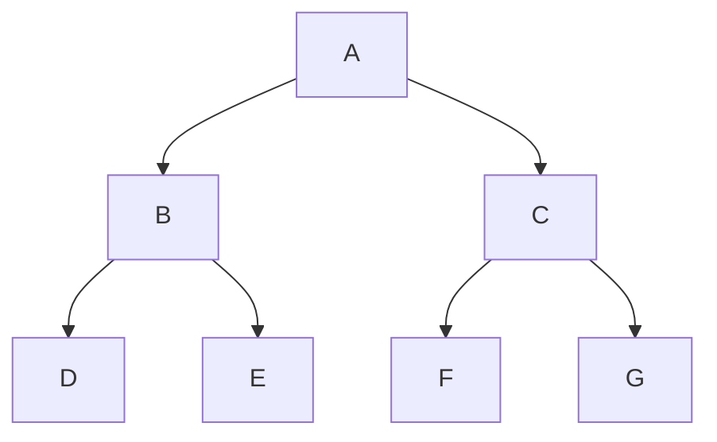

Binary trees and Binary Search
Recursion and Iteration
Linked lists
Strings and manipulation
Dynamic programming
Heaps, Trees, and the "Trie" data structures
Graphs (breadth-first search and depth-first search)
Sorting algorithms
Hashmaps and sets
Stacks and queues


Table of LeetCode
|  1st |  2nd |  3rd |        Question (leetcode #)       | Type & Difficulty |Time| Bug | Note |
|------|------|------|------------------------------------|-------------------|----|-----|------|
| 0307 |      |      |   Longest Palindrome               |                   |    |     |      |
| 0307 |      |      |   Valid Palindrome                 |                   |    |     |      |
| 0307 |      |      |   Implement strStr()               |                   |    |     |      |
| 0307 |      |      |   Longest Palindromic Substring    |                   |    |     |      |
|      |      |      |   Classical Binary Search          |                   |    |     |      |
|      |      |      |   First Position of Target         |                   |    |     |      |
|      |      |      |     Search a 2D Matrix             |                   |    |     |      |
|      |      |      |     Search a 2D Matrix II          |                   |    |     |      |
|      |      |      |     Search for a Range             |                   |    |     |      |
|      |      |      |   Total Occurrence of Target       |                   |    |     |      |
|      |      |      | Smallest Rectangle Enclosing Black Pixels  |           |    |     |      |
|      |      |      |          Copy Books                |                   |    |     |      |
|      |      |      |                                    |                   |    |     |      |
|      |      |      |                                    |                   |    |     |      |
|      |      |      |                                    |                   |    |     |      |
|      |      |      |                                    |                   |    |     |      |


a2df592ac0b48651a320e21456


# 1. Chapter 1. Hack the Algorithm Interview (4 Required, 3 Optional, 0 Related)
---Required---
627.Longest Palindrome
415.Valid Palindrome
13.Implement strStr()
200.Longest Palindromic Substring
---Optional---

# 2. Chapter 2. Binary Search & LogN Algorithm (10 Required, 10 Optional, 8 Related)
```python
if nums is None:
    return -1

start, end = 0, len(nums) - 1
while start + 1 < end:
    mid = start + (end - start) // 2
    if nums[mid] == target:
        return mid
    elif nums[mid] > target:
        end = mid
    else:
        start = mid
```

457.Classical Binary Search
14.First Position of Target
28.Search a 2D Matrix
38.Search a 2D Matrix II
61.Search for a Range
462.Total Occurrence of Target
600.Smallest Rectangle Enclosing Black Pixels
437.Copy Books
---Required---
458.Last Position of Target
585.Maximum Number in Mountain Sequence
460.Find K Closest Elements
447.Search in a Big Sorted Array
428.Pow(x, n)
159.Find Minimum in Rotated Sorted Array
140.Fast Power
75.Find Peak Element
74.First Bad Version
62.Search in Rotated Sorted Array
---Optional---

# 3. Chapter 3. Two Pointers Algorithm (10 Required, 10 Optional, 7 Related)
```python

# Linked List: Dummy Node
prev = None  # prev表示前继节点
while head: # head is not None
    tmp = head.next
    head.next = prev
    prev = head
    head = tmp

return prev
```


604.Window Sum
380.Intersection of Two Linked Lists
102.Linked List Cycle
103.Linked List Cycle II
380.Intersection of Two Linked Lists
415.Valid Palindrome
891.Valid Palindrome II
587.Two Sum - Unique pairs
382.Triangle Count
609.Two Sum - Less than or equal to target
443.Two Sum - Greater than target
533.Two Sum - Closest to target
59.3Sum Closest
58.4Sum
610.Two Sum - Difference equals to target
461.Kth Smallest Numbers in Unsorted Array
373.Partition Array by Odd and Even
144.Interleaving Positive and Negative Numbers
49.Sort Letters by Case
148.Sort Colors
894.Pancake Sorting
---Required---
228.Middle of Linked List
607.Two Sum III - Data structure design
539.Move Zeroes
521.Remove Duplicate Numbers in Array
464.Sort Integers II
608.Two Sum II - Input array is sorted
143.Sort Colors II
57.3Sum
31.Partition Array
5.Kth Largest Element
---Optional---


# 4. BFS & DFS
* BFS uses Queue (first in first out)
```python
# BFS
if root is None:
    return []

result = []
queue = [root]
while len(queue) != 0:

```
* DFS uses Stack (last in first out)
    - DFS -> Recursion

```python
# DFS (recursion)
```

```python
sys.maxsize  # MAX
(1 << 63) - 1
- sys.maxsize - 1  # MIN
# 32 Byte INT_MAX (2147483647) INT_MIN (-2147483648)
# 64 Byte INT_MAX (9223372036854775807) INT_MIN (-9223372036854775808)
```

## 4.1. Chapter 4. BFS & Topological Sort (10 Required, 11 Optional, 3 Related)
69.Binary Tree Level Order Traversal
70.Binary Tree Level Order Traversal II
71.Binary Tree Zigzag Level Order Traversal
242.Convert Binary Tree to Linked Lists by Depth
433.Number of Islands
892.Alien Dictionary
178.Graph Valid Tree
618.Search Graph Nodes
431.Connected Component in Undirected Graph
598.Zombie in Matrix
573.Build Post Office II
---Required---
433.Number of Islands
69.Binary Tree Level Order Traversal
615.Course Schedule
616.Course Schedule II
611.Knight Shortest Path
605.Sequence Reconstruction
137.Clone Graph
127.Topological Sorting
120.Word Ladder
7.Serialize and Deserialize Binary Tree
---Optional---

## 4.2. Chapter 5. Binary Tree & Tree-based DFS (10 Required, 12 Optional, 6 Related)
597.Subtree with Maximum Average
175.Invert Binary Tree
95.Validate Binary Search Tree
596.Minimum Subtree
88.Lowest Common Ancestor of a Binary Tree
86.Binary Search Tree Iterator
448.Inorder Successor in BST
67.Binary Tree Inorder Traversal
11.Search Range in Binary Search Tree
85.Insert Node in a Binary Search Tree
87.Remove Node in Binary Search Tree
---Required---
900.Closest Binary Search Tree Value
596.Minimum Subtree
480.Binary Tree Paths
453.Flatten Binary Tree to Linked List
93.Balanced Binary Tree
902.Kth Smallest Element in a BST
578.Lowest Common Ancestor III
95.Validate Binary Search Tree
901.Closest Binary Search Tree Value II
86.Binary Search Tree Iterator
---Optional---


## 4.3. Chapter 6. Combination-based DFS (10 Required, 3 Optional, 4 Related)
90.k Sum II
192.Wildcard Matching
154.Regular Expression Matching
582.Word Break II
---Required---
680.Split String
570.Find the Missing Number II
136.Palindrome Partitioning
153.Combination Sum II
152.Combinations
135.Combination Sum
18.Subsets II
17.Subsets
780.Remove Invalid Parentheses
582.Word Break II
---Optional---

## 4.4. Chapter 7. Permutation-based & Graph-based DFS (10 Required, 6 Optional, 3 Related)
33.N-Queens
52.Next Permutation
190.Next Permutation II
197.Permutation Index
198.Permutation Index II
132.Word Search II
---Required---
862.Next Closest Time
425.Letter Combinations of a Phone Number
10.String Permutation II
34.N-Queens II
33.N-Queens
16.Permutations II
15.Permutations
829.Word Pattern II
132.Word Search II
121.Word Ladder II
---Optional---

# 5. Data Structure

## 5.1. Chapter 8. Data Structure - Stack, Queue, Hash, Heap (10 Required, 12 Optional, 9 Related)
657.Insert Delete GetRandom O(1)
526.Load Balancer
954.Insert Delete GetRandom O(1) - Duplicates allowed
960.First Unique Number in a Stream II
138.Subarray Sum
105.Copy List with Random Pointer
171.Anagrams
124.Longest Consecutive Sequence
685.First Unique Number In Stream
545.Top k Largest Numbers II
228.Middle of Linked List
81.Find Median from Data Stream
613.High Five
486.Merge K Sorted Arrays
401.Kth Smallest Number in Sorted Matrix
---Required---
642.Moving Average from Data Stream
494.Implement Stack by Two Queues
209.First Unique Character in a String
657.Insert Delete GetRandom O(1)
612.K Closest Points
544.Top k Largest Numbers
104.Merge K Sorted Lists
40.Implement Queue by Two Stacks
4.Ugly Number II
134.LRU Cache
---Optional---

## 5.2. Chapter 9. Data Structure - Interval, Array, Matrix & Binary Indexed Tree (12 Required, 11 Optional, 11 Related)
6.Merge Two Sorted Arrays
486.Merge K Sorted Arrays
548.Intersection of Two Arrays II
793.Intersection of Arrays
149.Best Time to Buy and Sell Stock
405.Submatrix Sum
943.Range Sum Query - Immutable
665.Range Sum Query 2D - Immutable
817.Range Sum Query 2D - Mutable
249.Count of Smaller Number before itself
---Required---
839.Merge Two Sorted Interval Lists
547.Intersection of Two Arrays
138.Subarray Sum
64.Merge Sorted Array
41.Maximum Subarray
944.Maximum Submatrix
931.Median of K Sorted Arrays
840.Range Sum Query - Mutable
654.Sparse Matrix Multiplication
577.Merge K Sorted Interval Lists
486.Merge K Sorted Arrays
65.Median of two Sorted Arrays
---Optional---

# 6. Dynamic Programming

## 6.1. Chapter 10. Dynamic Programming (10 Required, 5 Optional, 2 Related)
---Required---
115.Unique Paths II
114.Unique Paths
111.Climbing Stairs
110.Minimum Path Sum
109.Triangle
603.Largest Divisible Subset
611.Knight Shortest Path
513.Perfect Squares
116.Jump Game
76.Longest Increasing Subsequence
---Optional---


## 6.2 Backpack

# 7. Union and Find
connecting graph
connecting-graph-ii
connecting-graph-iii

leetcode200. Number of Islands
leetcode323. Number of Connected Components in an Undirected Graph
leetcode305. Number of Islands II
leetcode261. Graph Valid Tree
leetcode130. Surrounded Regions
leetcode128. Longest Consecutive Sequence
leetcode547. Friend Circles

# 8. Trie


# 9. Sweeping Line

# 10. Sorting Algorithm
Mergesort
Quicksort



# Educative.io

### Pattern: Sliding Window
Maximum Sum Subarray of Size K (easy)
Smallest Subarray with a given sum (easy)
Longest Substring with K Distinct Characters (medium)
Fruits into Baskets (medium)
No-repeat Substring (hard)
Longest Substring with Same Letters after Replacement (hard)
Longest Subarray with Ones after Replacement (hard)

### Pattern: Two Pointers
Pair with Target Sum (easy)
Remove Duplicates (easy)
Squaring a Sorted Array (easy)
Triplet Sum to Zero (medium)
Triplet Sum Close to Target (medium)
Triplets with Smaller Sum (medium)
Subarrays with Product Less than a Target (medium)
Dutch National Flag Problem (medium)

### Pattern: Fast & Slow pointers
LinkedList Cycle (easy)
Start of LinkedList Cycle (medium)
Happy Number (medium)
Middle of the LinkedList (easy)

### Pattern: Merge Intervals
Merge Intervals (medium)
Insert Interval (medium)
Intervals Intersection (medium)
Conflicting Appointments (medium)

### Pattern: Cyclic Sort
Cyclic Sort (easy)
Find the Missing Number (easy)
Find all Missing Numbers (easy)
Find the Duplicate Number (easy)
Find all Duplicate Numbers (easy)

### Pattern: In-place Reversal of a LinkedList
Reverse a LinkedList (easy)
Reverse a Sub-list (medium)
Reverse every K-element Sub-list (medium)

### Pattern: Tree Breadth First Search
Binary Tree Level Order Traversal (easy)
Reverse Level Order Traversal (easy)
Zigzag Traversal (medium)
Level Averages in a Binary Tree (easy)
Minimum Depth of a Binary Tree (easy)
Level Order Successor (easy)
Connect Level Order Siblings (medium)

### Pattern: Tree Depth First Search
Binary Tree Path Sum (easy)
All Paths for a Sum (medium)
Sum of Path Numbers (medium)
Path With Given Sequence (medium)
Count Paths for a Sum (medium)

### Pattern: Two Heaps
Find the Median of a Number Stream (medium)
Sliding Window Median (hard)
Maximize Capital (hard)

### Pattern: Subsets
Subsets (easy)
Subsets With Duplicates (easy)
Permutations (medium)
String Permutations by changing case (medium)
Balanced Parentheses (hard)
Unique Generalized Abbreviations (hard)

### Pattern: Modified Binary Search
Order-agnostic Binary Search (easy)
Ceiling of a Number (medium)
Next Letter (medium)
Number Range (medium)
Search in a Sorted Infinite Array (medium)
Minimum Difference Element (medium)
Bitonic Array Maximum (easy)

### Pattern: Bitwise XOR
Single Number (easy)
Two Single Numbers (medium)
Complement of Base 10 Number (medium)

### Pattern: Top 'K' Elements
Top 'K' Numbers (easy)
Kth Smallest Number (easy)
'K' Closest Points to the Origin (easy)
Connect Ropes (easy)
Top 'K' Frequent Numbers (medium)
Frequency Sort (medium)
Kth Largest Number in a Stream (medium)
'K' Closest Numbers (medium)
Maximum Distinct Elements (medium)
Sum of Elements (medium)
Rearrange String (hard)

### Pattern: K-way merge
Merge K Sorted Lists (medium)
Kth Smallest Number in M Sorted Lists (Medium)
Kth Smallest Number in a Sorted Matrix (Hard)
Smallest Number Range (Hard)

### Pattern : 0/1 Knapsack (Dynamic Programming)
0/1 Knapsack (medium)
Equal Subset Sum Partition (medium)
Subset Sum (medium)
Minimum Subset Sum Difference (hard)

### Pattern: Topological Sort (Graph)
Topological Sort (medium)
Tasks Scheduling (medium)
Tasks Scheduling Order (medium)
All Tasks Scheduling Orders (hard)
Alien Dictionary (hard)


## Memorization + Dynamic Programming

1. fib(n)
    * store the value in an array memo[n], (or in a dictionary)
        * O(2^n) done things repeatedly -> linear time O(n)
    * space complexity/memory usage 
        * any memory in use -> array for memo + memory for call stack

2. grid, count the paths
    * go down/right
    * break down problems into subproblems 
    * path(start, end) = path(A, end) + path(B, end) recursion
    * grid[row][column] =  grid[y][x]  (COMMON MISTAKE), use row, column instead of x,y
    * recursion O(2^(N^2)) -> memorization O(N^2)
    * space complexity still O(N^2) but no longer needs the call stack


## Trie
* a tree structure, each node store characters
* path from root to leaf -> a word
* dictionary
```python
class Node{
    children = dict()
    isCompleteWord = False
}
```
* application: lookup for type check, valid prefix, validation of word

## QuickSort
pivot (randomly pick)
## MergeSort

## Bit Manipulation
binary pos/neg
addition
shifting
masks

## Bottom-Up 
Bottom-Up is a way to avoid recursion, saving the memory cost that recursion incurs when it builds up the call stack.

```python
# Recursion, top-down (starts from the end and works backwards)
def product_1_to_n(n):
    # We assume n >= 1
    return n * product_1_to_n(n - 1) if n > 1 else 1

# it builds up a call stack of size O(n), which makes our total memory cost O(n). This makes it vulnerable to a stack overflow error, where the call stack gets too big and runs out of space.

# bottom-up (starts from the beginning)
def product_1_to_n(n):
    # We assume n >= 1
    result = 1
    for num in range(1, n + 1):
        result *= num

    return result
# O(1) space O(n) time
```

Some compilers and interpreters will tail call optimization (TCO), where it can optimize some recursive functions to avoid building up a tall call stack. Python and Java decidedly do not use TCO. Some Ruby implementations do, but most don't. Some C implementations do, and the JavaScript spec recently allowed TCO. Scheme is one of the few languages that guarantee TCO in all implementations. In general, best not to assume your compiler/interpreter will do this work for you.

Going bottom-up is a common strategy for dynamic programming problems, which are problems where the solution is composed of solutions to the same problem with smaller inputs. The other common strategy for dynamic programming problems is memoization.


## max & min
```python
import sys
print(sys.maxsize)  # MAX
print((1 << 63) - 1)
print(- sys.maxsize - 1)   # MIN
# 32 Byte INT_MAX (2147483647) INT_MIN (-2147483648)
# 64 Byte INT_MAX (9223372036854775807) INT_MIN (-9223372036854775808)
```