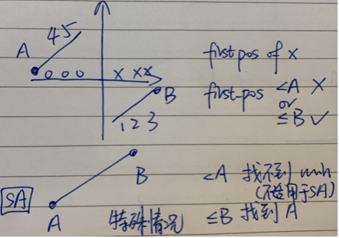

<!-- TOC -->

- [1. 二分法 Binary Search](#1-%E4%BA%8C%E5%88%86%E6%B3%95-binary-search)
    - [1.1. Binary Search](#11-binary-search)
    - [1.2. 独孤九剑——破剑式 比O(n)更优的时间复杂度 几乎只能是O(logn)的二分法](#12-%E7%8B%AC%E5%AD%A4%E4%B9%9D%E5%89%91%E7%A0%B4%E5%89%91%E5%BC%8F-%E6%AF%94on%E6%9B%B4%E4%BC%98%E7%9A%84%E6%97%B6%E9%97%B4%E5%A4%8D%E6%9D%82%E5%BA%A6-%E5%87%A0%E4%B9%8E%E5%8F%AA%E8%83%BD%E6%98%AFologn%E7%9A%84%E4%BA%8C%E5%88%86%E6%B3%95)
    - [1.3. 第一境界 二分法模板](#13-%E7%AC%AC%E4%B8%80%E5%A2%83%E7%95%8C-%E4%BA%8C%E5%88%86%E6%B3%95%E6%A8%A1%E6%9D%BF)
    - [1.4. 第二境界 二分位置 之 OOXX](#14-%E7%AC%AC%E4%BA%8C%E5%A2%83%E7%95%8C-%E4%BA%8C%E5%88%86%E4%BD%8D%E7%BD%AE-%E4%B9%8B-ooxx)
    - [1.5. 第三境界 二分位置 之 Half Half](#15-%E7%AC%AC%E4%B8%89%E5%A2%83%E7%95%8C-%E4%BA%8C%E5%88%86%E4%BD%8D%E7%BD%AE-%E4%B9%8B-half-half)
    - [1.6. 第四境界(至高境界): 二分答案 Binary Search on Result, 二分法难题 (Hard)](#16-%E7%AC%AC%E5%9B%9B%E5%A2%83%E7%95%8C%E8%87%B3%E9%AB%98%E5%A2%83%E7%95%8C-%E4%BA%8C%E5%88%86%E7%AD%94%E6%A1%88-binary-search-on-result-%E4%BA%8C%E5%88%86%E6%B3%95%E9%9A%BE%E9%A2%98-hard)
- [2. 搜索 Search](#2-%E6%90%9C%E7%B4%A2-search)
    - [2.1. 宽度优先搜索 Breadth First Search](#21-%E5%AE%BD%E5%BA%A6%E4%BC%98%E5%85%88%E6%90%9C%E7%B4%A2-breadth-first-search)
        - [2.1.1. 二叉树上的宽度优先搜索 BFS in Binary Tree](#211-%E4%BA%8C%E5%8F%89%E6%A0%91%E4%B8%8A%E7%9A%84%E5%AE%BD%E5%BA%A6%E4%BC%98%E5%85%88%E6%90%9C%E7%B4%A2-bfs-in-binary-tree)
        - [2.1.2. 图上的宽度优先搜索 BFS in Graph & 拓扑排序 Topological Sorting(必考)](#212-%E5%9B%BE%E4%B8%8A%E7%9A%84%E5%AE%BD%E5%BA%A6%E4%BC%98%E5%85%88%E6%90%9C%E7%B4%A2-bfs-in-graph--%E6%8B%93%E6%89%91%E6%8E%92%E5%BA%8F-topological-sorting%E5%BF%85%E8%80%83)
        - [2.1.3. 棋盘上/矩阵中的宽度优先搜索 BFS in Matrix (格子图)](#213-%E6%A3%8B%E7%9B%98%E4%B8%8A%E7%9F%A9%E9%98%B5%E4%B8%AD%E7%9A%84%E5%AE%BD%E5%BA%A6%E4%BC%98%E5%85%88%E6%90%9C%E7%B4%A2-bfs-in-matrix-%E6%A0%BC%E5%AD%90%E5%9B%BE)
    - [2.2. 深度优先搜索 Depth First Search](#22-%E6%B7%B1%E5%BA%A6%E4%BC%98%E5%85%88%E6%90%9C%E7%B4%A2-depth-first-search)
        - [2.2.1. 组合搜索问题 Combination 2**n](#221-%E7%BB%84%E5%90%88%E6%90%9C%E7%B4%A2%E9%97%AE%E9%A2%98-combination-2n)
        - [2.2.2. 排列搜索问题 Permutation](#222-%E6%8E%92%E5%88%97%E6%90%9C%E7%B4%A2%E9%97%AE%E9%A2%98-permutation)
        - [2.2.3. Non Recursion](#223-non-recursion)
- [3. Sweep Line 扫描线算法 处理区间问题的扫描线](#3-sweep-line-%E6%89%AB%E6%8F%8F%E7%BA%BF%E7%AE%97%E6%B3%95-%E5%A4%84%E7%90%86%E5%8C%BA%E9%97%B4%E9%97%AE%E9%A2%98%E7%9A%84%E6%89%AB%E6%8F%8F%E7%BA%BF)
- [4. 两根指针 Two Pointers](#4-%E4%B8%A4%E6%A0%B9%E6%8C%87%E9%92%88-two-pointers)
    - [4.1. 同向双指针](#41-%E5%90%8C%E5%90%91%E5%8F%8C%E6%8C%87%E9%92%88)
    - [4.2. 相向双指针](#42-%E7%9B%B8%E5%90%91%E5%8F%8C%E6%8C%87%E9%92%88)
    - [4.3. Two Sum & its variation](#43-two-sum--its-variation)
    - [4.4. Partition Array 分割数组](#44-partition-array-%E5%88%86%E5%89%B2%E6%95%B0%E7%BB%84)

<!-- /TOC -->


# 1. 二分法 Binary Search
1. 第一境界: 二分法模板
    递归与非递归的权衡
    二分的三大痛点 (while < 还是 while <=; 超出time limit)
    通用的二分法模板
2. 第二境界: 二分位置 之 圈圈叉叉 Binary Search on Index - OOXX (抽象化满足条件)
    找到满足某个条件的第一个位置或者最后一个位置
3. 第三境界: 二分位置 之 保留一半 Binary Search on Index - Half Half (log(n)的思想来源, 如何做到二分)
    保留有解的一半, 或者去掉无解的一半
4. 第四境界(至高境界): 二分答案

## 1.1. Binary Search
Given a sorted integer array nums, and an integer target.
Find the any/first/last position of target in nums. Return -1 if target does not exist.
(问last时, 容易出现死循环, 超时)
两个指针一头一尾 (left/right) 和target比较, 后将left/right移到中间, 直到left/right并到一起
if (nums[mid] < target)     O(1)的if语句

**时间复杂度 Time Complexity (面试必问)**
不要说 O(2n), O(n+10), O(n3+n2).. 
时间复杂度不论系数, 不论常数项, 只看最高项, 只关心数量级
n = 数据规模  O(2n)=O(n) 		O(n+10)=O(n) 		O(n3+n2)=O(n3)	 O(n2+nlogn)=O(n2)

T(n) = T(n/2) + O(1) = O(logn) 		通过O(1) 把n → n/2 规模的问题
通过O(1)的时间, 把规模为n的问题变为n/2
T(n) = T(n/2) + O(1) = T(n/4) + O(1) + O(1) = T(n/8) + 3O(1) =.. = T(n/n) + log2(n)×O(1) = T(1) + log2(n)×O(1)
T(n) = 规模为n的算法的时间复杂度  T(1)=输入规模为1时, 算法的时间复杂度

O(log2 n)=O(log4 n) = 2O(log2 n)   O(logn)=O(logn^2) = 2O(logn)	时间复杂度不管系数, log以什么为底无所谓

通过O(n)的时间, 把规模为n的问题变为n/2  (不是O(nlogn)!!!)
T(n) = T(n/2) + O(n) = T(n/4) + O(n/2) + O(n) = T(n/8) + O(n/4) +  O(n/2) + O(n) =.. (先不约去O(n/4)和O(n/2), 展开到最后再约去)
= T(1) + O(n) + O(n/2) + O(n/4) +.. O(1) = O(n+n/2+n/4+…+2+1) ≈ O(2n-1) = O(2n)= O(n)

空间复杂度 Space Complexity (很少问) —> 程序开了几个数组, 每个数组长度多少, 相加即可

Time Complexity in Coding Interview
* O(1)              极少    return 一个公式即可, 不用写程序
* O(logn)           几乎都是二分法	
* O(√n)             几乎是分解质因数	e.g 6=2×3 枚举至√n
* O(n)              高频     → 暴力 for 循环, O(n)之下只有O(logn)
* O(nlogn)          一般都可能要排序    先将数组排序, 解法豁然开朗~
* O(n^2)            数组, 枚举, 动态规划
* O(n^3)            数组, 枚举, 动态规划
* O(2^n)            与组合有关的搜索	e.g. subset题目
* O(n!)             与排列有关的搜索
考察如何计算时间复杂度, 面试中常考O(n), O(nlogn), O(n2)

## 1.2. 独孤九剑——破剑式 比O(n)更优的时间复杂度 几乎只能是O(logn)的二分法 
*经验之谈: 根据时间复杂度倒推算法是面试中的常用策略*
若一眼看就是O(n), 就要考虑O(logn)的实现方式了 → 两个指针一头一尾, 中间取点, 去一半

哪种方法实现二分法 Recursion or While Loop? 		R: Recursion W: While loop B: Both work 
(建议, 能不用recursion就不用, recursion是一个不好的coding pattern, 递归易造成stack overflow 栈溢出, 程序crash)

面试中是否使用 Recursion 的几个判断条件, 使用递归与非递归的权衡方法
* ①面试官是否要求了不使用 Recursion (如果你不确定, 就向面试官询问)
* ②不用 Recursion 是否会造成实现变得很复杂 (二分法一般不会很复杂)
* ③Recursion 的深度是否会很深
* ④题目的考点是 Recursion vs Non-Recursion, 还是就是考你是否会Recursion?
Note: 不要自己下判断, 要跟面试官讨论!

二分法常见痛点
* ①又死循环了! what are you 弄撒捏!
* ②循环结束条件到底是哪个?
    start <= end
    start < end	       两根指针指向同一个数时, 才会结束 (容易死循环)
    start + 1 < end    两个指针相邻即可结束 (避免死循环)
* ③指针变化到底是哪个?
    start = mid
    start = mid + 1
    start = mid - 1

## 1.3. 第一境界 二分法模板
- start + 1 < end               中间隔着一个时即可结束, 避免死循环; 精度不为1(i.e. 整数), 则 while end - start > precision
- mid = start + (end - start) / 2   等于mid=(start+end)/2 但避免s和e过大时造成越界; 一定是整数则 mid = s + (e - s) // 2
- A[mid] ==, <, >               三种情况分开讨论
- A[start] A[end] ? target      出了while循环后, 寻找结果; 二分法 → 不断缩小区间, 不一定直接return答案

Lintcode 457.[Classical Binary Search]()
Lintcode 14.[First Position of Target]()
Lintcode 458.[Last Position of Target]()

## 1.4. 第二境界 二分位置 之 OOXX 
一般会给你一个数组, 让你找数组中第一个/最后一个满足某个条件的位置 OOOOOOO..O**OX**X....XXXXXX
O=小于target的数, X=大于等于target的数, 找第一个X或者最后一个O

Lintcode 74.[First Bad Version]()

Lintcode 447.[Search in a Big Sorted Array]()
排序数组二分法 → 二分, 起点+终点, 取中点
现在没有终点怎么办? 找终点, 令点 ≥ target (终点要在k的级别上)
Vector/ArrayList: 动态数组实现方式, 不用声明多大多长, 倍增思想, 和网络访问的exponential backoff类似
	*Note: 一道题问完用什么数据结构, 还会追问数据结构的实现方式*
要求复杂度O(log k) 	k是数所在位置
以2倍递增 1→2→4→8 直到 ≥target, 共递增logk次  (可以确定数在 [k, 2k]范围里)

Lintcode 159.[Find Minimum in Rotated Sorted Array]()  oooooxxxxx
 
- Sorted Array ⊆ Rotated Sorted Array (在做RSA的题时, 需要考虑没有rotated的情况)
- RSA: 
    x is the First Position <= last number? ✔️
    x is the First Position <= or < First Number? (WRONG)

Lintcode 28.[Search a 2D Matrix]() 不是二分法, 但是是常考题
Lintcode 38.[Search a 2D Matrix II]() 不是二分法, 但是是常考题
- 从左下角开始，往右上角逼近

Lintcode 61.[Search for a Range]() First Position of Target + Last Position of Target

Lintcode 600.[Smallest Rectangle Enclosing Black Pixels]()
在列中需要找出第一个'1'出现的最左侧坐标和最右侧坐标, 在行中需要找出第一个'1'出现的最上面坐标和最下面坐标。采用二分的方法在区间查找即可。最后返回(right - left + 1) * (down - up + 1)即可。

## 1.5. 第三境界 二分位置 之 Half Half
无法找到一个条件, 形成 OOXX 的模型; 但可以根据判断, 保留下有解的那一半或者去掉无解的一半

Lintcode 585.[Maximum Number in Mountain Sequence]() 在先增后减的序列中找最大值

Lintcode 75.[Find Peak Element]()
先增后减数组, 一定有peak(局部最大); 找所有peak→for循环, O(n) 		
找一个peak → 非排序数组如何二分?
四种情况  
- mid-1 < mid < mid+1 (递减区间, 左半部分一定有峰)   
- mid-1>mid>mid+1 (有半部分一定有峰) 
- mid > mid-1 & mid+1 (mid就是峰, return it)      
- mid < mid-1 & mid+1 (左右两边都至少存在一个解)

有时选算法, 看要求的答案个数(为下限)

Lintcode 62.[Search in Rotated Sorted Array]()  会了这道题, 才敢说自己会二分法
4 5 6 7 0 1 2   target=6
o o x x o o o   (not ooxx)

二分思想要求, 去掉一半后, 剩下的一半必须还是刚开始的构型。
    → 二分之后必须还是RSA (SA⊆RSA)
* Soln 1: 找最小的数(找到o/找最小) O(logn), 然后还原成 ooxx, 但还原操作为O(n) 不🉑
* Soln 2: 用两次二分的方法
    第一次二分找到最小数的位置, find minimum number in rotated sorted array
    第二次二分确定 target, 在左侧区间还是右侧 (start ≤ target ≤ mid 答案在左边,  target > mid && target < start 答案在右边) 
    再用一个普通的二分法即可找到
* Soln 3: 用一次二分法
    start ≤ target ≤ mid 答案在左边;  target > mid && target < start 答案在右边

二分思想要求, 去掉一半后, 剩下的一半必须还是刚开始的构型 → 二分之后必须还是RSA (SA⊆RSA)

Lintcode 39.[Recover Rotated Sorted Array]() in-place
Lintcode 8.[Rotate String]() in-place
三步翻转法 3 step reverse: [4,5,1,2,3] → [5,4,1,2,3] → [5,4,3,2,1] → [1,2,3,4,5] offset=2

Lintcode 459.[Closest Number in Sorted Array]()
Lintcode 460.[Find K Closest Elements]()
oooxxxx 先找到x 然后左右两个指针分别往两边移动  O(logn + k)  因为不知道logn和k哪个大

## 1.6. 第四境界(至高境界): 二分答案 Binary Search on Result, 二分法难题 (Hard)
往往没有给你一个数组让你二分, 同样是找到满足某个条件的最大或者最小值 (原题求最大/最小不太好做时, 可以考虑二分答案)

解题方法: 通过猜值判断是否满足题意不对去搜索可能解  (原问题 max/min是多少 转换为 判定问题 Yes/No)
1.找到可行解范围 2.猜答案 3.检验条件 4.调整搜索范围

按值二分, 找到单调的地方

二分查找某个元素在数组中的位置的时间复杂度 O(logn). 每次操作都选择当前数组的中位数与目标元素值比较, 若比目标值更大, 则在中位数前继续寻找, 反之在中位数后寻找, 这样每次可以将搜索范围缩小一半

哪种写法会出现死循环? A 若left=0, right=1, mid=0, 且nums[mid] < target的条件下, 出现死循环
```python
while left < right:
    mid = left + (right - left) // 2
    if nums[mid] < target:
        left = mid
    else:
        right = mid

while left + 1 < right:
    mid = left + (right - left) // 2
    if nums[mid] < target:
        left = mid
    else:
        right = mid 

while left < right:
    mid = left + (right - left) // 2
    if nums[mid] < target:
        left = mid + 1
    else:
        right = mid - 1

while left <= right:
    mid = left + (right - left) // 2
    if nums[mid] < target:
        left = mid + 1
    else:
        right = mid - 1
```

LintCode 75. [Find Peak Element]()
给定A[0..n-1], 其中没有相邻元素相同, 并且A[0] < A[1], A[n-2] > A[n-1], 找到任意一个P, 满足A[P-1] < A[P] > A[P+1]
输入: [1, 5, 6, 8, 7, 9, 4]  输出: 3

- 首先, 这样的P肯定存在  (尝试举一个反例 a0 < a1 < .. < an-2 < an-1, 但与A[n-2] > A[n-1]矛盾, 故一定可以找到)
- 因为A[0] < A[1], 如果A[1]不是要找的元素, A[1] < A[2]; ... A[2] < A[3]; ... 但是A[n-2] > A[n-1]
- 二分查找: 对于mid位置, 如果A[mid] < A[mid+1], 右边一定有答案, 继续向右找; 否则左边一定有答案, 向左

Lintcode 390.[Find Peak Element II]() TODO

Lintcode 141.[Sqrt(x)]()
Last number that number^2 <= x
follow up: what if return a double, not an integer?

Lintcode 586.[Sqrt(x) II]()
一直二分直到 |number^2 - x| <= 1e-10
- 先找下界(0), 在找下界(x), 再二分
- 总长度L; 二分一次 L/2, 二分两次 L/2^2
- 若ε=10^-t, L/2^x ≤ 1e-t, 2^x ≥ L/1e-t, 则 x ≥ log(L/1e-t) = logL - log(1e-t) = logL + t log10 ≥ logL + 3t

LintCode 183. [Wood Cut]()
长度分别是L[0]..L[n-1]的n块木头, 要求找到最长的长度s, 使得这些木头可以切出至少k块长度为s的木头(不可以拼接)
输入: L=[232, 124, 456], k=7 输出: 114  ( ⎣232/114⎦ + ⎣124/114⎦ + ⎣456/114⎦ = 2 + 1 + 4 = 7 )
- 规律: 对于一个长度s, 如果可以切出t段; 而对于另一个长度S>s, 可以切出T段, 则一定有t>=T
- 所以如果长度s切出的段数不够k, 答案肯定比s小; 同理, 如果长度s切出的段数>=k, 答案肯定>=s  
- 二分答案: 二分切割后获得的每一段木头的长度 (该题需要求出每一小段木头的最长长度, 因此应二分切割后获得的每一段木头的长度)

- 原问题(不好做) -> max S, 使得 ⎣L[0]/S⎦ + ⎣L[1]/S⎦ + .. ⎣L[n-1]/S⎦ ≥ k
- 二分答案的判断性问题 -> 给定 S, 切出木头数目是否 ≥ k   
- 上界, 能切出的木头最长 max L[i]; 下界, 最短 1 (必须是整数)
- 时间复杂度: O(f(n) · log 答案范围/答案精度) 
    f(n) = 每次问是/否这件事的时间复杂度  (求⎣L[0]/S⎦ + ⎣L[1]/S⎦ + .. ⎣L[n-1]/S⎦ ≥ k ?  -->  O(n))
    二分的时间复杂度: 答案范围=上界-下界=L-1; 答案精度=1
    TC = O(nlogL)

LintCode 437.[Copy Books]()
有N本书需要被抄写, 第i本书有A, i=0, 1, ..., N-1; 有K个抄写员, 每个抄写员可以抄写连续的若干本书 (例如: 第3~5本书, 或者第10本书); 每个抄写员的抄写速度都一样, 最少需要多少时间抄写完所有的书 (取决于抄的最慢的人)
输入: A = [3, 2, 4], K=2  输出: 5 (第一个抄写员抄写第1本和第2本书, 第二个抄写员抄写第3本书) 
* Soln 1: DP (TC高)
* Soln 2: 
- 题目要求K个抄写员抄完最少需要的时间; 反过来想, 如果我们限定时间不超过T, 最少需要的抄写员 → 贪心法
    证明贪心法正确性: 假如最优答案不这么做, 可以把它变成这么做, 且最优性不变
- 从第一本书开始, 第一个人一直抄到时间即将超过T; 第二个人, ...
- 如果需要的抄写员>K, 说明答案一定>T (条件太苛刻, 放宽条件 --> 增加T); 反之答案<=T (条件太宽松 --> 减少T) → 二分答案
    两个序列, 抄完需要的人 (单调递减), 抄完需要的时间 (单调递增)
- 上界: 一个人抄, A[0]+ .. +A[n-1]; 下界: 很多人抄 max{A[i]}

LintCode 633.[Find the Duplicate Number]()
给定一个长度为n+1的数组, 其中均为1到n之间的整数; 保证只有一个数字重复了多次; 找到这个数字 (辅助空间只能O(1); 只能开几个变量..)
输入: [5,5,5,1,2,3] 输出: 5
* Soln 1: 双重for循环
* Soln 2:
    [1, 2, .. P-1, P, P, P, P+1, n] 共n-1个数, 则大于P的最多n-P个数字; 小于等于P的数字多于n+1-n-P=P+1个
    若x > P, 小于等于x的数字多于x+1个; 若x < P, 小于等于x的书最多x个   → 找到了 ‘分水岭’
    - ≤w的数小于w个, P在右边; ≤w的数大于w个, w=P 或 P≤w (左边)

    - 假设答案是S, 数组一定是(假设排好序) [1,3,...,S,...,S,S+1,...,n], 那么其中<=S的数大于S
    - 对于所有T >= S, <=T的个数大于T
    - 对于所有T < S, <=T的个数小于等于T
    - TC=O(nlogn) (求小于等于某数的数字有多少个, O(n); 二分, O(logn))

LintCode 617.[Maximum Average Subarray II]() 二分答案的典型题目
给定一个数组A, 找到其中平均值最大的子数组, 要求长度>=k
输入: [1, 12, -5, -6, 50, 3], k = 3  输出: 15.667   (-6+50+3)/3=15.667

如果要求和最大, 可以用前缀和数组。但是平均值最大不好求 (数组问题, 求平均值一般都较难, 因为既和总和有关, 又和个数有关)
* Soln 1: 枚举起点和重点, 使用前缀和数组 (双指针不行)
* Soln 2: 二分答案
    - 判断性问题: 子数组平均值能否 ≥ T?
    - 如果最大平均值是T, 则目标是找到(A[left] + ... + A[right]) / (right - left + 1) >= T, 且right - left + 1 >= k
    - 即(A[left]-T) + ... + (A[right]-T) >= 0
        对于一个T, 把每个元素A[i]减去T得到B[i]
        希望找到最大的B[left] + ... + B[right] >= 0, 且right - left + 1 >= k
        可以通过前缀和实现
        如果找不到这样的(left, right), 说明答案小于T → 二分答案

# 2. 搜索 Search

## 2.1. 宽度优先搜索 Breadth First Search
什么时候应该使用BFS? (BFS 就是循环)
① 图的遍历 Traversal in Graph
   * 层级遍历 Level Order Traversal    (起点 → 一层一层遍历)
   * 由点及面 Connected Component   (A&B能否联通)
   * 拓扑排序 Topological Sorting

② 最短路径 Shortest Path in Simple Graph   
仅限简单图求最短路径 (简单图: 图中每条边长度都是1, 且没有方向 unweighted & undirected)

如果题目问最短路径, 除了BFS还可能是什么算法? BFS只能解决边长为1的最短问题, 还可以用动态规划DP
如果问最长路径呢? DFS, DP

### 2.1.1. 二叉树上的宽度优先搜索 BFS in Binary Tree
创建一个队列, 把起始节点放进去 (第一层节点)
while队列不空, 处理队列中的节点, 并拓展出新的节点 (for 上一层节点, 拓展下一层节点 → 层级遍历)
level x → x+1

if root is None: return [ ]    # 而不是 return None !!!

Lintcode 69.[Binary Tree Level Order Traversal]() 图的遍历(层级遍历) 
树是图的一种特殊形态, 树属于图

Soft and Deep copy (深度拷贝)
A deep copy constructs a new compound object and then, recursively, inserts copies into it of the objects found in the original.
import java.util.ArrayList;

public class HelloWorld{
     public static void main(String []args){
        ArrayList<Integer> list1 = new ArrayList<>();
        ArrayList<Integer> list2 = list1;    // soft copy, 只copy了reference
        list1.add(1);       		// list1, list2均为 [1]
        System.out.println(list1);
        System.out.println(list2);
        ArrayList<Integer> list3 = new ArrayList<>(list1);  // deep copy/clone, copy content
        list1.add(2);  			// list3为[1], list1, list2为[1, 2]
        System.out.println(list1);
        System.out.println(list2);
        System.out.println(list3);
     }
}

deep copy in BFS → 每次加进去的是相同的东西
no deep copy → 每次加进去的是新new出来的东西

宽搜BFS使用队列Queue作为主要的数据结构  (Queue可以用linked list实现, delete/add为O(1))
用栈(Stack)是否可行? BFS标配Queue, DFS标配Stack

是否需要实现分层? 需要分层的算法比不需要分层的算法多一个循环 

size=queue.size()
如果直接 for (int i = 0; i < queue.size(); i++) 会怎么样?   for上一层节点, 拓展出新的节点
queue.size()在变化→所有的东西都挤在一层

**Serialization 序列化**
什么是序列化?  数据 → 字符串, 在传输中很重要
将“内存”中结构化的数据变成“字符串”的过程 序列化:object to string 反序列化:string to object

什么时候需要序列化?
* ①将内存中的数据持久化存储时
    内存中重要的数据不能只是呆在内存里, 这样断电就没有了, 所需需要用一种方式写入硬盘, 在需要的时候, 能否再从硬盘中读出来在内存中重新创建
* ②网络传输时, 机器与机器之间交换数据的时候, 不可能互相去读对方的内存。只能讲数据变成字符流数据(字符串)后, 通过网络传输过去。接受的一方再将字符串解析后到内存中。 
    常用的一些序列化手段:
    - XML 耗费空间, 但可读性高
    - Json 和JS兼容
    - Thrift (by Facebook)  可以序列化, 也可以做别的。
    - ProtoBuf (by Google) 可以序列化, 也可以做别的。可以远程函数调用

一些序列化的例子:
    比如一个数组, 里面都是整数, 我们可以简单的序列化为"[1,2,3]"
    一个整数链表, 我们可以序列化为 "1->2->3"
    一个哈希表(HashMap), 我们可以序列化为 "{\"key\": \"value\"}"

序列化算法设计时需要考虑的因素:
* ①压缩率: 对于网络传输和磁盘存储而言, 当然希望更节省。
  如 Thrift, ProtoBuf 都是为了更快的传输数据和节省存储空间而设计的。
* ②可读性: 希望开发人员, 能够通过序列化后的数据直接看懂原始数据是什么。如 Json, LintCode 的输入数据

Binary Tree Serialization & 多叉树序列化
二叉树如何序列化? 你可以使用任何你想要用的方法进行序列化, 只要保证能够解析回来即可。
LintCode采用的是 BFS的方式对二叉树数据进行序列化, 好处是可以更为容易的自己画出整棵二叉树。

算法描述: http://www.lintcode.com/en/help/binary-tree-representation/  层级遍历

Lintcode 7.[Serialize and Deserialize Binary Tree]()

toString() 算序列化
Note: 现在配置文件流行用yaml, 以前用html, 后来用json

Lintcode 70.[Binary Tree Level Order Traversal II]()
Lintcode 71.[Binary Tree Zigzag Level Order Traversal]()
Lintcode 242.[Convert Binary Tree to Linked Lists by Depth]()

### 2.1.2. 图上的宽度优先搜索 BFS in Graph & 拓扑排序 Topological Sorting(必考)
问: 和树上有什么区别? 树→父子关系; 图→双向关系, 可能存在地位平等(邻居关系)   directed/undirected graph
图是点和边组成的结构, 甚至可以不联通  G = < V, E > 

套用social network背景来考察图 (六度理论: 问A和B是几度关系? 用BFS, 从A开始层级遍历)

图中存在环(图和树的本质区别) --> 同一个节点可能重复进入队列
    图中BFS时, 用hashmap/hashset记录是否完成任务

Lintcode 178.[Graph Valid Tree]()
图的遍历(由点及面) 图是数的 (条件1) N个点, N-1条边 (条件2) N个点连通 (从o出发可以联通所有点)
	BFS求连通性: 灌水法 flood fill. queue当前队列, hashset放入所有进入过队列的点 (看哈希表是不是n个数)
如何用基本数据结构表示一个图?  用hashmap {vertex, its neighbors} → {integer, hashset(int)} 

Lintcode 137.[Clone Graph]() = deep copy		
图的遍历(由点及面)  copy nodes, copy edges
训练code structure的好题, 所有程序实现在一个函数, 逻辑不清晰; 好程序其实不需要注释, 就能读懂

独孤九剑——破枪式
能够用 BFS 解决的问题, 一定不要用 DFS 去做! 能用 BFS 的一定不要用 DFS (除非面试官特别要求)
因为用 Recursion 实现的 DFS 可能造成 StackOverflow! (NonRecursion 的 DFS你不会写, 面试官也看不懂)

Lintcode 618.[Search Graph Nodes]()
http://www.lintcode.com/problem/search-graph-nodes/ 
图的遍历(由点及面) 为什么不需要做分层遍历?
如何找所有最近的value=target的点? 分层遍历

Lintcode 127.[Topological Sorting]()
http://www.lintcode.com/problem/topological-sorting/ 
拓扑排序可以用来检测循环依赖 (e.g 先修课程的问题), 拓扑排序不是一个排序算法, 排的是topo order
几乎每个公司都有一道拓扑排序的面试题! 
indegree(入度): 有多少条边指向此点,   hashmap 点→点的入度   
入度为0的点为start node, 将入度0的放进队列进行BFS
可以使用 DFS 来做么? 可以 (但不用递归, 用stack)

Lintcode 615.[Course Schedule]()
Lintcode 616.[Course Schedule II]() 裸拓扑排序
Lintcode 605.[Sequence Reconstruction]()
http://www.lintcode.com/problem/sequence-reconstruction/
判断是否只存在一个拓扑排序的序列 只需要保证队列中一直最多只有1个元素即可

能不能被拓扑排序? 判断有没有入度为0的点

### 2.1.3. 棋盘上/矩阵中的宽度优先搜索 BFS in Matrix (格子图)
图 Graph: N个点, M条边, M最大是 O(N^2) 的级别 (两两连通), 图上BFS时间复杂度 O(N + M)   (点边之和)
    说O(M)问题也不大, 因为M一般都比N大 所以最坏情况可能是 O(N^2)
矩阵 Matrix: R行C列, R * C个点, R * C * 2 条边(每个点上下左右4条边, 每条边被2个点共享),  矩阵中BFS时间复杂度 O(R*C)

Lintcode 433.[Number of Islands]()
http://www.lintcode.com/problem/number-of-islands/
http://www.jiuzhang.com/solutions/number-of-islands/ 

坐标变换数组
int[] deltaX = {1, 0, 0, -1}; 
int[] deltaY = {0, 1, -1, 0};
如何写出八个方向的坐标变换数组?
四个方向用四个if语句非常bad, 用坐标变换数组和if语句; inbound函数, 测一下在不在边界范围内

Lintcode.[Zombie in Matrix]()
http://www.lintcode.com/problem/zombie-in-matrix/ 
http://www.jiuzhang.com/solutions/zombie-in-matrix/ 
图的遍历(层级遍历)  分层遍历
大写variable name来定义常量, 甚至可以加static, 写在外面, 千万不要写在程序里!!
public int PEOPLE = 0;
public int ZOMBIE = 1;
public int WALL = 2;
千万别写 grid[?][?] == 1;    // bad coding style, 1是什么不直观

Lintcode.[Knight Shortest Path]()
http://www.lintcode.com/problem/knight-shortest-path/ 
http://www.jiuzhang.com/solutions/knight-shortest-path/ 
简单图最短路径  八个方向 BFS
follow up: speed up?

  无向图联通块
  http://www.lintcode.com/problem/connected-component-in-undirected-graph/   

 覆盖黑点的最小矩阵(BFS无法AC但是可以作为BFS的练习题)
  http://www.lintcode.com/problem/smallest-rectangle-enclosing-black-pixels/

简单图最短路径
  单词阶梯
  http://www.lintcode.com/problem/word-ladder/

  建邮局问题 Build Post Office II 简单图最短路径
  http://www.lintcode.com/en/problem/build-post-office-ii/
  http://www.jiuzhang.com/solutions/build-post-office-ii
(方法一) 从空格出发
	循环枚举所有的office修建未知的可能性(空格)
	计算从这个位置出发到达所有房子的距离之和
	在所有方案中找到最小的距离和
(方法二) 从房子出发
	循环枚举所有的房子位置
	从房子出发, 机选每个空格到达房子的距离之和
	累加某个空格到达其他所有房子距离之和
	在所有空格中, 找到最小距离和


## 2.2. 深度优先搜索 Depth First Search

Recursion(不特别说明的话, DFS用recursion实现; 有几道题需要掌握non-recursion的方式)
难度 BFS < DFS < DP

Note: DFS把结果放入results中, 一定要使用deep copy!

面试时脚本语言(Ruby, Python)更占便宜

什么时候使用 DFS? 找所有的方案; 找最优的问题, 找最短/最长问题 (但很少)
什么时候使用 BFS? 图的遍历问题(层级遍历, 联通问题灌水法, 拓扑排序) + 简单图最短路径问题

独孤九剑 —— 破鞭式   找所有方案的题, 一定是DFS
90% DFS的题, 要么是排列, 要么是组合

### 2.2.1. 组合搜索问题 Combination 2**n
问题模型:求出所有满足条件的“组合”
判断条件:组合中的元素是顺序无关的
时间复杂度:与 2^n 相关  因为 

一般来说, 如果面试官不特别要求的话, DFS都可以使用递归(Recursion)的方式来实现。 
递归三要素是实现递归的重要步骤: 递归的定义   递归的拆解   递归的出口

*** Lintcode 135-Combination Sum
和subsets的区别?
  Combination Sum 限制了组合中的数之和→加入一个新的参数(target)来限制
  Subsets 无重复元素, Combination Sum 有重复元素→ 需要先去重
  Subsets 一个数只能选一次, Combination Sum 一个数可以选很多次 → 搜索时从 index 开始而不是从 index + 1

*** Lintcode 153-Combination Sum II
如何去重? (错误做法) 找到所有结果后再去重  (正确做法) 选代表

*** Lintcode 136-Palindrome Partitioning
如何优化?
→用hashmap存储回文串, 但这样没效果
	getkey不是 O(1), 是O(size of key), 取决于用作key的字符串有多长..
→用二维数组


### 2.2.2. 排列搜索问题 Permutation
(相比组合问题少start index, 但同一个数不能重复的选, 所以多一个set放使用过的数或者使用过数的下标)
问题模型: 求出所有满足条件的“排列”
判断条件: 组合中的元素是顺序“相关”的
时间复杂度:与 n! 相关

*** Lintcode 15-Permutations
*** Lintcode 16-Permutations II
如何去重?

*** Lintcode 33-N Queens

通用的DFS时间复杂度计算公式 O(答案个数 * 构造每个答案的时间)
搜索的时间复杂度：O(答案总数 * 构造每个答案的时间)
举例：Subsets问题，求所有的子集。子集个数一共 2^n，每个集合的平均长度是 O(n) 的，所以时间复杂度为 O(n * 2^n)，同理 Permutations 问题的时间复杂度为：O(n * n!)
动态规划的时间复杂度：O(状态总数 * 计算每个状态的时间复杂度)
举例：triangle，数字三角形的最短路径，状态总数约 O(n^2) 个，计算每个状态的时间复杂度 O(1)——就是求一下 min。所以总的时间复杂度为 O(n^2)
用分治法解决二叉树问题的时间复杂度：O(二叉树节点个数 * 每个节点的计算时间)
举例：二叉树最大深度。二叉树节点个数为 N，每个节点上的计算时间为 O(1)。总的时间复杂度为 O(N)

Search in a Graph 图中的搜索

*** Lintcode 120-Word Ladder
http://www.lintcode.com/problem/word-ladder/
http://www.jiuzhang.com/solutions/word-ladder/

*** Lintcode Word Ladder II
http://www.lintcode.com/problem/word-ladder-ii/
http://www.jiuzhang.com/solutions/word-ladder-ii/

### 2.2.3. Non Recursion 
基本上都会用上栈(Stack)
必“背”程序
Tree Traversal
http://www.jiuzhang.com/solutions/binary-tree-preorder-traversal/
http://www.jiuzhang.com/solutions/binary-tree-inorder-traversal/ 
http://www.jiuzhang.com/solutions/binary-tree-postorder-traversal/ 
http://www.jiuzhang.com/solutions/binary-search-tree-iterator/ 

Combination
http://www.jiuzhang.com/solutions/subsets/
Permutation
http://www.jiuzhang.com/solutions/permutations/

总结 Conclusion
  什么时候用 DFS?   求所有方案时
  怎么解决DFS?
  不是排列就是组合
  复杂度怎么算?
  O(答案个数 * 构造每个答案的时间复杂度)
  非递归怎么办?   必“背”程序


# 3. Sweep Line 扫描线算法 处理区间问题的扫描线 
见到区间需要排序, 就可以考虑扫描线 (区间问题巧妙解法)
扫描问题的特点: 1.事件往往是以区间的形式存在  2.区间两端代表事件的开始和结束  3.按照区间起点排序, 起点相同的按照终点排序
扫描线要点: 将起点和终点打散排序 [[1, 3], [2, 4]] => [[1, start],[2, start],[3, end],[4, end]]

有5架飞机的起飞降落时间为[[1, 10], [2, 3], [5, 9], [4, 7], [6, 11]], 区间左端点代表飞机的起飞时间, 右端点为飞机的降落时间, 同时最多有多少架飞机在空中? 在时刻6, 共有第1345四架飞机在空中

LintCode 391: [Number of Airplanes in the Sky]() 扫描线经典入门题目
给定n架飞机的起飞降落时间, 求最多时天上有多少飞机; 如果一架飞机的降落时间恰好等于另一架飞机的起飞时间, 则认为先降落
输入: [[1, 10], [2, 3], [5, 8], [4, 7]]  输出: 3
* Soln 1: 事件event是关键点 (1 2 3 4 5 7 8 10)
    没有事件发生的空白区域, 飞机数目不变
    检查端点, n条线段, 2n端点, O(n^2)
* Soln 2:
    - 将每架飞机的起降时间作为区间左右端点, 建立两个事件
    - 对所有事件排序, 相同时间的事件降落排在起飞前面  排序O(nlogn)
    - 扫描: O(n)
        扫描线, 定义计数器 t=0时, C=0 (0飞机)
        遇到起飞事件(左端点, 加事件), C+=1; 遇到降落事件(右端点, 减事件), C-=1
        C的最大值即为答案
* Python使用HashHeap, Java用TreeSet/TreeMap, C++可以用Map/Multimap
* Follow-Up: 如果同时起降, 认为先起飞, 怎么修改算法? 相同时间起降, 起飞排在降落前

LintCode 131.[The Skyline Problem/Building Outline]()
给定n个矩形的坐标, 底边都在X轴, 求出所有矩形组成图形的外轮廓线/天际线  (覆盖这一点的矩形, 谁最高)
输入: [[2, 9, 10], [3, 7, 15], [5, 12, 12], [15, 20, 10], [19, 24, 8]]
输出: [[2, 10], [3, 15], [7, 12], [12, 0], [15, 10], [20, 8], [24, 0]]
* 将每个矩形的左边和右边建立两个事件, 记下对应高度
* 对所有事件按X坐标排序, 从小到大  TC=O(nlogn)
* 建立高度的最大堆 (动态维护, 添加/删除/求最大元素的操作, 用优先队列/堆)
* 扫描线:
    遇到左边事件, 堆中加入高度
    遇到右边事件, 堆中删除高度
    堆中最大值即为组合图形现在的高度
* 将同一个X坐标的事件全部处理完后, 如果新高度(新堆中最大值)≠原来的高度, 说明出现拐点, 记录下来
* Follow-Up: 形成的面积?
* Building Outline算法动图模拟 https://briangordon.github.io/2014/08/the-skyline-problem.html

哪种数据结构有快速的添加元素, 删除元素, 求最大元素值的操作? 堆/优先队列, 可以在O(logn)的时间复杂度中完成添加元素, 删除元素, 求最大元素值的操作。单调栈也可以, 但优先队列更方便

LintCode 919. [Meeting Rooms II]()

LintCode 821. [Time Intersection]() F家高频题 输出两组区间的交集


# 4. 两根指针 Two Pointers 

## 4.1. 同向双指针
*** Lintcode 604-Window Sum
*** Lintcode 521-Move Zeroes 
*** Lintcode 521-Remove Duplicate Numbers in Array

## 4.2. 相向双指针
http://www.lintcode.com/problem/valid-palindrome/
http://www.lintcode.com/problem/rotate-string/ 
http://www.lintcode.com/en/problem/recover-rotated-sorted-array/

## 4.3. Two Sum & its variation
*** Lintcode 56-Two Sum
return 下标的话无论用hashmap还是sort+two pointers, 额外空间一定是O(n)
但是如果return的是满足条件的数值, 使用sort+two pointers, 额外空间是O(1)

只能用 HashMap: 
*** Lintcode 607-Two Sum III - Data structure design
http://www.lintcode.com/problem/two-sum-data-structure-design/ 

sorted array用 Two Pointers 会更快 (两个pointer一头一尾)
*** Lintcode 608-Two Sum II - Input array is sorted

*** Lintcode 587-Two Sum - Unique pairs
http://www.lintcode.com/en/problem/two-sum-unique-pairs/
是否可以先去重?

3Sum
http://www.lintcode.com/problem/3sum/
统计所有的和为 0 的三元组 (Triples)

Triangle Count
http://www.lintcode.com/problem/triangle-count/

独孤九剑 —— 破掌式 对于求 2 个变量如何组合的问题
可以循环其中一个变量, 然后研究另外一个变量如何变化

Two Sum 计数问题
统计所有和 <= target 的配对数 
http://www.lintcode.com/problem/two-sum-less-than-or-equal-to-target/ 

统计所有和 >= target 的配对数 
http://www.lintcode.com/en/problem/two-sum-greater-than-target/ 

Two Sum Closest
http://www.lintcode.com/problem/two-sum-closest-to-target/

Follow Up: 3Sum Closest
http://www.lintcode.com/problem/3sum-closest/

Related  Lintcodes
  4Sum
  http://www.lintcode.com/problem/4sum/
 
  Two Sum - difference equals to target (同向双指针)
  http://www.lintcode.com/problem/two-sum-difference-equals-to-target/

## 4.4. Partition Array 分割数组
Quick Select
分成两个部分
分成三个部分
一些你没听过的(但是面试会考的)排序算法

31. Partition Array
http://www.lintcode.com/problem/partition-array/


Quick Select
http://www.lintcode.com/problem/kth-smallest-numbers-in-unsorted-array/

小视频:http://www.jiuzhang.com/video/quick-select/

Related  Lintcodes
  Partition Array by Odd and Even
  http://www.lintcode.com/problem/partition-array-by-odd-and-even/
  http://www.jiuzhang.com/solutions/partition-array-by-odd-and-even/  
  Interleaving Positive and Negative Numbers
  http://www.lintcode.com/problem/interleaving-positive-and-negative-numbers/
  http://www.jiuzhang.com/solutions/interleaving-positive-and-negative-integers/  
  Sort Letters by Case
  http://www.lintcode.com/problem/sort-letters-by-case/
  http://www.jiuzhang.com/solutions/sort-letters-by-case/

Sort Colors
http://www.lintcode.com/problem/sort-colors/
分成两个部分 vs 分成三个部分

排序 Rainbow Sort
http://www.lintcode.com/en/problem/sort-colors-ii/
问:猜一猜最优的时间复杂度?

其他有趣的排序
烙饼排序 Pancake Sort(有可能会考哦) 
https://en.wikipedia.org/wiki/Pancake_sorting 
http://www.geeksforgeeks.org/pancake-sorting/
睡眠排序 Sleep Sort https://rosettacode.org/wiki/Sorting_algorithms/Sleep_sort
面条排序 Spaghetti Sort https://en.wikipedia.org/wiki/Spaghetti_sort
猴子排序 Bogo Sort https://en.wikipedia.org/wiki/Bogosort
  (还有前面学的拓扑排序)

unique pairs
closest to target
difference = target
