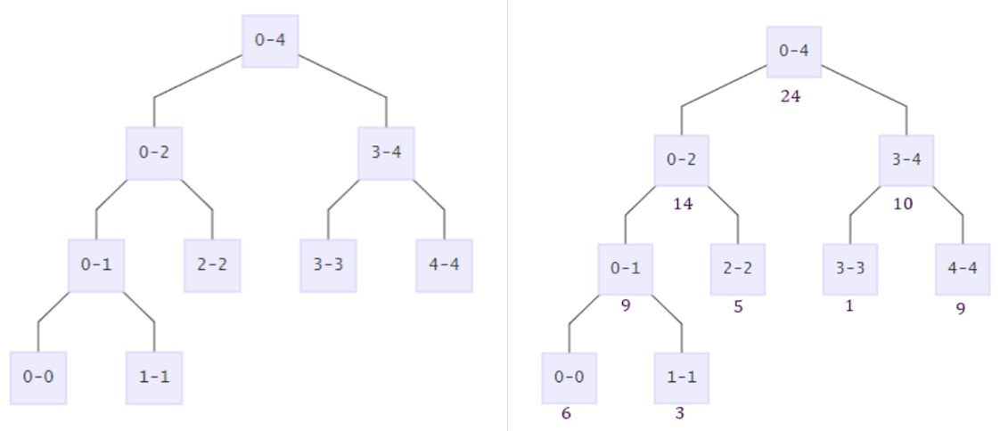
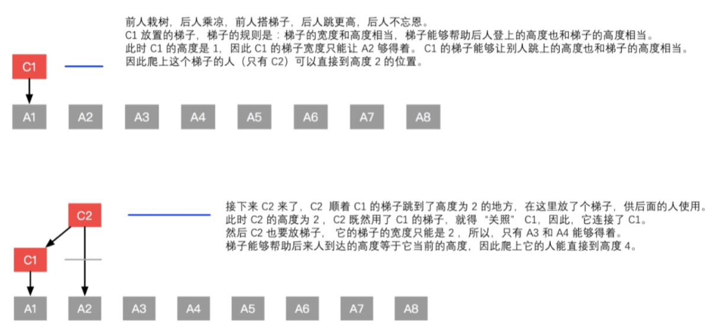
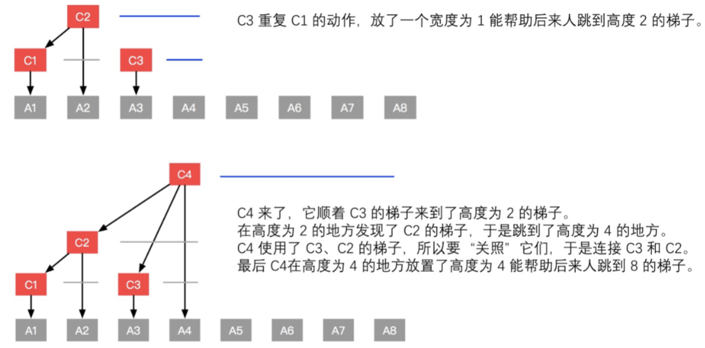
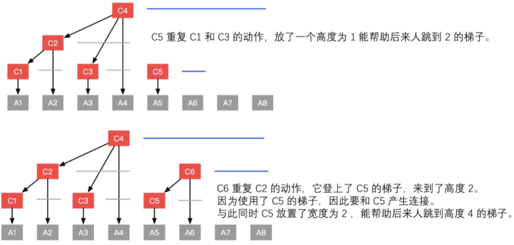
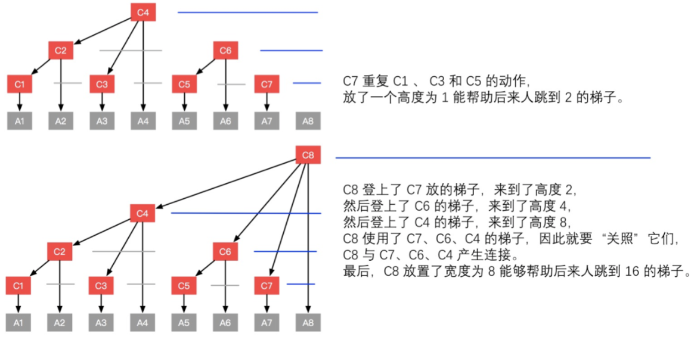

<!-- TOC -->

- [1. 二叉树与分治法 Binary Tree & Divide Conquer](#1-二叉树与分治法-binary-tree--divide-conquer)
  - [1.1. 二叉树的遍历算法 Traverse in Binary Tree: Preorder / Inorder / Postorder](#11-二叉树的遍历算法-traverse-in-binary-tree-preorder--inorder--postorder)
  - [1.2. 二叉树的深度优先搜索 DFS in Binary Tree](#12-二叉树的深度优先搜索-dfs-in-binary-tree)
- [2. 链表 Linked List](#2-链表-linked-list)
  - [2.1. Dummy Node](#21-dummy-node)
  - [2.2. Double Link List](#22-double-link-list)
- [3. 数组 Array](#3-数组-array)
  - [3.1. Sorted Array 排序数组](#31-sorted-array-排序数组)
  - [3.2. 子数组 Subarray](#32-子数组-subarray)
- [4. 哈希表 Hash 原理 & 应用](#4-哈希表-hash-原理--应用)
- [5. Stack 栈 & Heap 堆 & Queue(Priority Queue)](#5-stack-栈--heap-堆--queuepriority-queue)
  - [5.1. 堆 Heap = 优先队列 Priority Queue](#51-堆-heap--优先队列-priority-queue)
    - [5.1.1. 双堆](#511-双堆)
  - [5.2. 栈 Stack](#52-栈-stack)
    - [5.2.1. 单调栈 Monotonous stack](#521-单调栈-monotonous-stack)
- [6. Deque 双端队列](#6-deque-双端队列)
- [7. 并查集 Union Find 集合的合并查找操作,并查集](#7-并查集-union-find-集合的合并查找操作并查集)
- [8. 字典树Trie, Prefix Tree 前缀树](#8-字典树trie-prefix-tree-前缀树)
  - [8.1. Trie用于剪枝](#81-trie用于剪枝)
  - [8.2. Typeahead Trie 在系统设计中的运用 (实际运用)](#82-typeahead-trie-在系统设计中的运用-实际运用)
- [9. 线段树 Segment Tree](#9-线段树-segment-tree)
  - [9.1. 线段树的构建](#91-线段树的构建)
  - [9.2. 线段树的修改](#92-线段树的修改)
  - [9.3. 线段树的查询](#93-线段树的查询)
  - [9.4. Python 线段树](#94-python-线段树)
    - [9.4.1. SideNote: staticmethod & classmethod](#941-sidenote-staticmethod--classmethod)
  - [9.5. 线段树Lintcode](#95-线段树lintcode)
- [10. 树状数组 binary index tree](#10-树状数组-binary-index-tree)
  - [10.1. 树状数组算法分析](#101-树状数组算法分析)
  - [10.2. 树状数组的构建](#102-树状数组的构建)
    - [10.2.1. lowbit](#1021-lowbit)
  - [10.3. Python 树状数组](#103-python-树状数组)
  - [10.4. 树状数组Lintcode:](#104-树状数组lintcode)
- [11. Skiplist 跳表 (动态数据结构)](#11-skiplist-跳表-动态数据结构)
- [12. 红黑树 Red-Black Tree (动态数据结构)](#12-红黑树-red-black-tree-动态数据结构)

<!-- /TOC -->
- 数据结构 Heap (双堆)
- 数据结构 Stack (单调栈)
- 数据结构 Array
- 数据结构 Linked List
- 数据结构 Deque
- 数据结构 并查集Union Find   Done
- 数据结构 字典树Trie   Done
- 数据结构 树状数组 
- 数据结构 线段树

数据结构的适用范围(可以解决什么问题), 没有一个DS/Alg是万能的, 都有使用范围

What is Data Structure? 可以认为是一个集合, 并且提供集合上的若干操作
 
# 1. 二叉树与分治法 Binary Tree & Divide Conquer
Note: Binary Tree 非递归不太好写时, 可以考虑用递归
二叉树节点个数 node n, 二叉树高度 h, 搜索的时间复杂度是O(h), 不是O(logn)
递归太深 stackoverflow (run out of memory)      stack=进程独享的空间
balanced tree 搜索, 最好的情况O(logn), 最坏的情况O(n)

通过O(n)的时间, 把n的问题, 变为了两个n/2的问题, 复杂度是多少? 
方法一:
T(n)=2T(n/2) +O(n) = 2(2T(n/4) +O(n/2))+O(n) = 4T(n/4) + 2O(n) = 8T(n/8) + 3O(n) = .. 
	= nT(1)+lognO(n) = nO(1)+O(nlogn) = O(nlogn)
例如MergeSort, 劈一半, 通过O(n)合并
方法二: 树形分析法计算时间复杂度

通过O(1)的时间, 把n的问题, 变成了两个n/2的问题, 复杂度是多少?
T(n)=2T(n/2) +O(1) = 2(2T(n/4) +O(1))+O(1) = 8T(n/8) + O(1+2+4) = .. 
	= nT(n/n)+O(1+2+..+n) = nO(1) +O(2n) = nO(1) +O(n)=O(n)

## 1.1. 二叉树的遍历算法 Traverse in Binary Tree: Preorder / Inorder / Postorder
Lintcode 66.[Binary Tree Preorder Traversal]() 前序遍历	        根左右
Lintcode 67.[Binary Tree Inorder Traversal]() 中序遍历		    左根右
Lintcode 68.[Binary Tree Postorder Traversal]() 后序遍历   	    左右根

必背程序 -- 非递归版本的Pre-Order, In-Order Traversal

## 1.2. 二叉树的深度优先搜索 DFS in Binary Tree
搜索 → 搜出答案无重复
- 遍历问题 Preorder / Inorder / Postorder
- 分治算法 Introduce Divide Conquer Algorithm
- 非递归 遍历法 分治法 Non-recursion vs Traverse vs Divide Conquer   
- 二叉搜索树 Binary Search Tree: Insert / Remove / Find / Validate

递归三要素: 定义+拆解+出口 (以及递归的调用)

Divide Conquer Algorithm 分治法
Traverse vs Divide Conquer
- They are both Recursion Algorithm
- Result in parameter(有一个全局变量) vs Result in return value   
- Top down vs Bottom up

递归是深度优先搜索算法(DFS)的一种实现形式, 但DFS可以使用非递归的方式实现

!!! MergeSort和QuickSort必考
90% Binary Tree Problems!  (可以用D&C)

二叉树上的递归 Recursion in Binary Tree (遍历法 Traverse  / 分治法 Divide Conquer)

独孤九剑——破枪式 
碰到二叉树的问题, 就想想整棵树在该问题上的结果和左右儿子在该问题上的结果之间的联系是什么

Lintcode 97.[Maximum Depth of Binary Tree]()

Lintcode 480.[Binary Tree Paths]()
DFS→return 所有路径 → D &C / Traverse
二叉树→拆成左右子树 divide, 然后conquer (merge)
出口通常只用处理 root==null
所有二叉树一定要验证, 当root只有一个点时, 答案是否正确
叶子节点, 单独处理 root.left==null && root.right==null

Lintcode 596.[Minimum Subtree]()
方法一 Traverse + Divide Conquer  (遍历需要全局变量)   DS和T并不互补, 可以结合使用
	计算sum of subtree (左右子树之和+root), 可以把每个点扫一遍加起来
方法二 只用Divide Conquer 来实现

Result Type 当return一个值不够时, 新建一个类当做结果类型, 打包~
	class ResultType { int var1, var2; }

Lintcode 93-Balanced Binary Tree]()
BBT为logn, 因为平衡 任意节点左右子树高度之差 <1		
When we need ResultType? 若不用ReturnType, 会出现二义性, 不好(e.g 有时return int, 有时return None)
	return -1 代表不平衡, 编程习惯不好! (-1 不明确究竟是什么, 不好的命名风格)
 
Lintcode 597.[Subtree with Maximum Average]()
	(防止溢出 int→long float→double)
Lintcode 88.[Lowest Common Ancestor of a Binary Tree]()  最近公共祖先
	TreeNode存parent, 若没有parent呢? 若无root呢? 没法做啊
	with parent pointer vs no parent pointer follow up: LCA II & III

Binary Search Tree(BST) 二叉查找树/二叉搜索树/排序二叉树
BST 基本性质
从定义出发: 左子树都比根节点小, 右子树都不小于根节点
从效果出发: 中序遍历 in-order traversal 是“不下降”序列   	如图, 中序遍历为 1 2 3 4 5
性质: 如果一棵二叉树的中序遍历不是“不下降”序列, 则一定不是BST   
	 如果一棵二叉树的中序遍历是不下降, 也未必是BST
	 比如下面这棵树就不是BST, 但是它的中序遍历是不下降序列
功能: O(h)的时间查找, 删除, 插入

BST高度O(n), 只有BBT为O(logn) & 最优二叉树Huffman Tree为O(logn) → 堆用最优二叉树

Lintcode 95.[Validate Binary Search Tree]()
https://www.lintcode.com/problem/validate-binary-search-tree
	traverse vs divide conquer
	return 左边最大的, 右边最小的

Lintcode 1534.[Convert Binary Search Tree to Doubly Linked List]()
	inorder 中序遍历          分治 or traverse      D&C通用性更强     BST的traverse简单

Lintcode 453.[Flatten Binary Tree to Linked List]()

Lintcode 86.[Binary Search Tree Iterator]()
https://www.lintcode.com/problem/binary-search-tree-iterator

Lintcode 448.[Inorder Successor in BST]()

Lintcode 11.[Search Range in Binary Search Tree]()
Lintcode 85.[Insert Node in a Binary Search Tree]()  (不用recursion怎么写???)
Lintcode 87.[Remove Node in Binary Search Tree]()
Hibbard deletion algorithm  http://www.mathcs.emory.edu/~cheung/Courses/171/Syllabus/9-BinTree/BST-delete.html

# 2. 链表 Linked List
Lintcode 35.[Reverse Linked List](https://github.com/bitterengsci/algorithm/blob/master/九章算法/基础班LintCode/Reverse%20Linked%20List.py)
Lintcode 450.[Reverse Nodes in k-Group](https://github.com/bitterengsci/algorithm/blob/master/九章算法/基础班LintCode/Reverse%20Nodes%20in%20k-Group.py)

## 2.1. Dummy Node
独孤九剑 —— 破索式 链表结构发生变化时, 就需要 Dummy Node
如何使用 Dummy Node
head = dummy 这句话总是需要么?
什么时候使用 Dummy Node?
Dummy Node 是否需要删除?
使用 Dummy Node 算面试官会说我耗费了额外空间么? 
Dummy Node 非用不可么?
Dummy Node 初始化的值重要么? 
链表的问题都需要用到 Dummy Node 么?


用到了 Dummy Node 的值得一做的题目
Lintcode .[]() http://www.lintcode.com/en/problem/partition-list/
Lintcode .[]() http://www.lintcode.com/en/problem/merge-two-sorted-lists/ 
Lintcode .[]() http://www.lintcode.com/en/problem/reverse-linked-list-ii/ 
Lintcode .[]() http://www.lintcode.com/en/problem/swap-two-nodes-in-linked-list/ 
Lintcode .[]() http://www.lintcode.com/en/problem/reorder-list/ 
Lintcode .[]() http://www.lintcode.com/en/problem/rotate-list/

Lintcode .[Copy List with Random Pointer]() http://www.lintcode.com/problem/copy-list-with-random-pointer/

Lintcode .[Linked List Cycle]()http://www.lintcode.com/en/problem/linked-list-cycle/

follow up:
Lintcode .[]() http://www.lintcode.com/en/problem/linked-list-cycle-ii/ 

Lintcode .[Sort List]()
http://www.lintcode.com/en/problem/sort-list/
排序算法时间复杂度是 O(nlogn): MergeSort, HeapSort, QuickSort
排序算法空间复杂度是 O(1): QuickSort

Related  Lintcodes
Lintcode .[]() http://www.lintcode.com/problem/convert-sorted-list-to-balanced-bst/
Lintcode .[]() http://www.lintcode.com/problem/delete-node-in-the-middle-of-singly-linked-list/
Lintcode .[]() http://www.lintcode.com/problem/convert-binary-search-tree-to-doubly-linked-list/


## 2.2. Double Link List


XOR Linked List (memory efficient)
- every node stores the XOR of addresses of previous and next nodes
```python
import ctypes
class Node:
    def __init__(self, val):
        self.data = val
         
        # XOR of next and previous node
        self.npx = 0 


# A^B=B^A=C, A^C=C^A=B, B^C=C^B=A
class XORLinkedList:

    def __init__(self):
        self.head = None
        self.nodes = []

    def prepend(self, data):
        node = Node(data)

        node.npx = id(self.head)

        if self.head is not None:
            self.head.npx = id(node) ^ self.head.npx   

        self.head = node
        self.nodes.insert(0, node)

    def print(self):

        if self.head != None:
            prev_id = 0
            curr = self.head
            next_id = 1

            while curr is not None:
                print(curr.data, "->")

                # get address of next node
                next_id = prev_id ^ curr.npx

                # update prev and next for next iteration
                prev_id = id(curr)
                curr = ctypes.cast(next_id, ctypes.py_object).value
```


# 3. 数组 Array

## 3.1. Sorted Array 排序数组

Lintcode 6.[Merge Two Sorted Arrays]()

Lintcode 64.[Merge Sorted Array]() 将小数组归并到大数组里

Lintcode 547.[Intersection of Two Arrays]() 两个数组的交

数组内积(点乘) [1, 3] · [2, 4] = 1 * 2 + 3 * 4 = 14
Follow up: 两个数组都非常大, 但是其中都包含很多0? [1,0,0,0,0 ..., 0, 2, 0,..., 0, 3] · [0,..., 0, 4, 0,..., 0, 5]
```python
from operator import mul
def dot_product(*vectors):
    """
    Compute the dot product of sparse vectors, where each vector is represented as a list of (index, value) tuples.
    >>> v1 = [(0, 2), (1, 4), (5, 6)]       # (2, 4, 0, 0, 0, 6)
    >>> v2 = [(1, 3), (2, 4), (5, 7)]       # (0, 3, 4, 0, 0, 7)
    >>> dot_product(v1, v2)
    54
    """
    vectors = [dict(v) for v in vectors]
    indices = (set(v.iterkeys()) for v in vectors)
    return sum(reduce(mul, (v[i] for v in vectors)) for i in set.intersection(*indices))
```

Lintcode 65.[Median of two Sorted Arrays]()

## 3.2. 子数组 Subarray
令前缀和数组 PrefixSum[i] = A[0] + A[1] + ... A[i - 1], PrefixSum[0] = 0
构造 PrefixSum 耗费 O(n)时间 和 O(n)空间
如需计算子数组从下标i到下标j之间的所有数之和, 则有 Sum(i~j) = PrefixSum[j + 1] - PrefixSum[i]

Lintcode 41.[Maximum Subarray]()

Lintcode 138.[Subarray Sum]()

Lintcode 139.[Subarray Sum Closest]()


# 4. 哈希表 Hash 原理 & 应用
支持操作: O(1) Insert / O(1) Find / O(1) Delete 
Hash Table / Hash Map / Hash Set 的区别是什么?

Hash Function 
* 使命: 对于任意的key, 得到一个固定且无规律的介于0~capacity-1的整数
* 一些著名的Hash算法: MD5, SHA-1, SHA-2
    ```java
    int hashfunc(String key){
        return md5(key) % hash_table_size;
    }
    ```
* 以 String 为例子
    ```java
    int hashfunc(String key){
        int sum = 0;
        for (int i = 0; i < key.length(); i++){
            sum = sum * 31 + (int)(key.charAt(i));   // Magic Number 31
            sum = sum % HASH_TABLE_SIZE;
        }
        return sum;
    }
    ```
    - Magic Number 31
    经验值, 这个数字选择一个质数会更好(经验) 
    数太大, 影响计算速度; 数太小, 冲突太多
    像Apache的底层库中, 用的是33

Open Hashing vs Closed Hashing 再好的 hash 函数也会存在冲突(Collision) 
* Closed Hashing:
    Linear Probing: f(i) = i
    Quadratic Probing: f(i) = i * i
    Double Hashing: f(i) = i * hash2(elem)
* Open Hashing

Rehashing 当hash不够大时怎么办?
Lintcode 129.[Rehashing]()
For negative integer in hash table, the position can be calculated as follow:
- C++/Java: if you directly calculate -4 % 3 you will get -1. You can use function: a % b = (a % b + b) % b to make it is a non negative integer.
- Python: you can directly use -1 % 3, you will get 2 automatically.

哈希表的饱和度 = 实际存储元素个数 / 总共开辟的空间大小 = size / capacity
一般来说, 超过 1/10(经验值) 的时候, 需要进行 rehash

Lintcode 134.[LRU Cache]() Least Recently Used (LRU) cache
When the cache reached its capacity, it should invalidate the least recently used item before inserting a new item.
* Soln 1: set() a linear search TC=O(n)
* Soln 2: get() set() TC=O(1)
    * Python implementation using OrderedDict
    * Java Implementation using LinkedHashMap (LinkedHashMap = DoublyLinkedList + HashMap)
        HashMap<key, DoublyListNode> DoublyListNode {   prev, next, key, value;   }
    * Newest node append to tail, Eldest node remove from head
    * Singly List 是否可行? 可以, 在 Hash 中存储 Singly List 中的 prev node 即可
        e.g. linked list = dummy->1->2->3->null 时, hash[1] = dummy, hash[2] = node1 ...

Lintcode 134.[LFU Cache]() Least Frequently Used (a famous cache eviction algorithm)
For a cache with capacity k, if the cache is full and need to evict a key in it, the key with the lease frequently used will be kicked out.

Lintcode 138.[Subarray Sum]() use hashmap to store previous prefix sum
Lintcode 105.[Copy List with Random Pointer]() 
* Soln 1: HashMap, O(n) space
* Soln 2: O(1) space, 没有使用HashMap, 首先把clone node链接到原有链表, 再拷贝random节点引用

Lintcode 171.[Anagrams]()
Two strings are anagram if they can be the same after change the order of characters.

Lintcode 124.[Longest Consecutive Sequence]()

# 5. Stack 栈 & Heap 堆 & Queue(Priority Queue)
队列 Queue 
支持操作: O(1) Push / O(1) Pop / O(1) Top
BFS的主要数据结构, 多做做BFS的题就可以了
 
栈 Stack 
支持操作: O (1) Push / O(1) Pop / O(1) Top 
非递归实现DFS的主要数据结构
 
独孤九剑 —— 破箭式 BFS 的主要数据结构是 Queue, DFS 的主要数据结构是 Stack, 千万不要搞反了! 很体现基础知识的扎实度!

堆 Heap
支持操作: O(log N) Add / O(log N) Remove / O(1) Min or Max 
Max Heap vs Min Heap

原理: 小视频
应用: 优先队列 Priority Queue
替代品: TreeMap

Priority Queue vs Heap 
Heap的基本原理和具体实现 (我们放到了九章算法强化班中)
请见课程小视频 http://www.jiuzhang.com/video/heap

Lintcode .[Ugly Number]() http://www.lintcode.com/problem/ugly-number-ii/ 
 
Lintcode .[Top k Largest Number II]() http://www.lintcode.com/problem/top-k-largest-numbers-ii/ 

Lintcode .[Merge K Sorted Lists]() http://www.lintcode.com/problem/merge-k-sorted-lists/ 
 
三种方法, 都需要练习
方法一:使用 PriorityQueue 
方法二:类似归并排序的分治算法 
方法三:自底向上的两两归并算法
时间复杂度均为 O(NlogK)
 
Related Lintcodes
Lintcode .[]() http://www.lintcode.com/en/problem/high-five/ (A)
Lintcode .[]() http://www.lintcode.com/en/problem/k-closest-points/ (L, A, F)
Lintcode .[]() http://www.lintcode.com/problem/merge-k-sorted-arrays/
Lintcode .[]() http://www.lintcode.com/problem/data-stream-median/
Lintcode .[]() http://www.lintcode.com/problem/top-k-largest-numbers/
Lintcode .[]() http://www.lintcode.com/problem/kth-smallest-number-in-sorted-matrix/

TreeMap(optional) 
又想知道最小值, 又想支持修改和删除
https://docs.oracle.com/javase/7/docs/api/java/util/TreeMap.html
通常来说, 面试中几乎没有必须要用 TreeMap 的题
 
Lintcode .[]() http://www.lintcode.com/problem/building-outline/
Lintcode .[]() http://www.lintcode.com/problem/top-k-frequent-words/

## 5.1. 堆 Heap = 优先队列 Priority Queue
堆 Heap = 优先队列 Priority Queue -> 树的结构
支持操作: O(1) Min/Max 求最大/最小 (=根的值)    log(N) Push 插入    log(N) Pop 删除

python: heapq (最小堆 -> 最大堆, 插入时值取负) Java: PriorityQueue  (可以自定义比较函数) C++: priority_queue
堆存在一维数组里, 根x, 左子2x+1, 右子2x+2 (左子<根, 右子<根)
- 解决动态求最大/小值
- 解决动态第K大/小问题 
- 双堆可以解决动态中位数 (不平衡 -> Balance操作)

向一个空数组中逐渐添加数字[3, 5, 4, 8, 6], 前1个数, 前2个数.. 前5个数的中位数是多少? 假设数组的中位数为排序后index为(n-1)/2的数字, 其中n为数组长度, index从0开始. 
[3]的中位数为3, [3, 5]的中位数为3, [3, 5, 4]的中位数为4, [3, 5, 4, 8]的中位数为4, [3, 5, 4, 8, 5]的中位数为5, 因此为[3, 3, 4, 4, 5]

在求前1个数, 前2个数..前n个数的中位数时, 可以使用两个堆, 用最大堆维护较小的n/2个数, 用最小堆维护较大的后n/2个数。(K个数的中位数, 本质上就是求第k/2小和第k/2大, 因此对于前k/2个较小的数, 我们需要求出最大值, 因此使用最大堆, 而对于后k/2个数, 我们需要求出最小值, 因此使用最小堆)

若要动态维护第K大的数, 应将前K个数加入最小堆。(每次要看的是当前加入的数与前k大的数中最小的数的大小关系, 因此应将前K个数加入最小堆)

### 5.1.1. 双堆
LintCode 81: [Find Median from Data Stream](https://github.com/bitterengsci/algorithm/blob/master/九章算法/强化班LintCode/Find%20Median%20from%20Data%20Stream.py) Data Stream Median 数据流中位数
给N个数, 求前1个数、前2个数...、前N个数的中位数 (the median is A[n//2])
输入:[4,5,1,3,2,6,0] 输出:[4,4,4,3,3,3,3]
* Soln 1: 每次排序, 取中位数k/2, TC=O(n^2logn)
* Soln 2: QuickSelect, 平均O(n)每次, overall TC=O(n^2)  n个数求中位数(静态) -> quickselect
* Soln 3: 类似插入排序, 寻找中位数:O(n2)
* Soln 4: 
    K个数的中位数, 需要知道第K/2小和第K/2大 (最大堆+最小堆)
    动态(有插入/删除操作)维护中位数一般都是用双堆解决 (同理: 动态维护第K大数)  TC=O(nlogn)
    ```text
    [......, N/2, ......]
    <---------->
        最大
            <---------->
                最小
    * 新数加入最大堆or最小堆
    * 调整堆的平衡
    ```

LintCode 360: [Sliding Window Median](https://github.com/bitterengsci/algorithm/blob/master/九章算法/强化班LintCode/Sliding%20Window%20Median.py)
给定N个数, 求每连续K个数的中位数
输入:[1,2,7,8,5], K = 3 输出:[2, 7, 7]
和Data Stream Median类似(多一个删除操作), 因为窗口移动需要删除已经不在窗口的元素 
维护第K/2小和第K/2大 (最大堆+最小堆)
堆中存数组的index, 不要存数字 (否则相同的数字不知道删除哪个)
TC=O(nlogn)

LintCode 364.[Trapping Rain Water II]()
给定一个n x m的2D地图每个格子的高度, 求其中可以装多少单位的水
输入: 
[[12,13,0,12],
[13,4,13,12],
[13,8,10,12],
[12,13,12,12],
[13,13,13,13]]
输出:14

- 一个格子高度h, 它上面能盛多少水
    检查所有从这个格子到边界的路径, 每条路径i都有最大高度值Mi
    所有路径最小的Mi值就是这个格子的吃水线, 吃水线-h=盛水量
    max{0, 所有路径最小的Mi值-h} 就是答案, 木桶原理
- 用最小堆维护访问的点, 先访问边界一圈的点 (边界的格子不能装水)
- 每次从最小堆顶拿出点P, 向其周围4个方向上看未曾访问过的点, 如Q
    如果Q的高度<=P的吃水线, 说明Q的吃水线就是P的吃水线, 因为Q是第一次被访问到
    如果Q的高度>P的吃水线, 则说明它不能装水, Q的吃水线就是自身的高度
    将(Q, Q的吃水线)加入Heap中 (堆储存已经求过吃水线的位置)
- TC=mnlog(mn)  m*n个点, 每个点只能被插入堆一次, 每次插入log(mn)
- 堆保证吃水线低的先求, 高的后求 (因此不需要求出所有路径的最小吃水线)

## 5.2. 栈 Stack
先进后出
计算机中实现递归的方式
支持操作: O(1) Push     O(1) Pop        O(1) Top

若一个栈的进栈序列是a,b,c,d, 在进栈过程中或进栈结束后有一些出栈操作, 则不可能的出栈序列是?
adcb可以通过push, pop, push, push, push, pop, pop, pop来获得
dcba可以通过push, push, push, push, pop, pop, pop, pop来获得
dcab无法通过入栈和出栈获得
abcd可以通过push, pop, push, pop, push, pop, push, pop来获得

LintCode 12: [Min Stack]()
支持一个栈的push, pop和min操作, 时间复杂度都是O(1)
```python
push(1)
pop() # return 1 
push(2)
push(3)
min() # return 2 
push(1)
min() # return 1
```
栈的push和pop都是O(1)
求min可以用一个辅助栈minStack, 和stack一样大 (stack插入时, minStack也插入; stack删除时, minStack也删除)
minStack里每个元素表示stack里对应位置元素到栈底的最小值

LintCode 575.[Decode String]()
给定一个表达式, 其中"数字[表达式]"表示方括号里的表达式重复数字次。输出展开的表达式
s = abc3[a], 输出: abcaaa
s = 3[abc], 输出: abcabcabc
s = 4[ac]dy, 输出: acacacacdy
s = 3[2[ad]3[pf]]xyz, 输出: adadpfpfpfadadpfpfpfadadpfpfpfxyz
```text
[.....................]
^                     ^
递归 push             pop   
```
* Soln 1: 可以DFS
* Soln 2: 改成非递归需要栈
    数字和字符都push
    见到"["push当前数字入栈 
    字符直接压栈
    见到"]"就pop字符直到碰到数字A
    这些字符组成的字符串重复A次

[2[3[a]2[bc]]]解码后应为aaabcbcaaabcbc (a重复3次, bc重复两次, 得到aaabcbc; 再把此序列重复2次)

### 5.2.1. 单调栈 Monotonous stack
栈中只保存升序序列 (新元素插入前, pop掉所有比它大的)
stack([1, 2, 8, 10]).push(5) => stack([1, 2, 5])
- 实现非递归  (树的前中后序遍历, 非递归版, 也是常考)
- 单调栈专门解决找一个值左/右第一个比它大/小的值 
- 线性时间复杂度 O(n)

LintCode 122: [Largest Rectangle in Histogram]()
给定直方图中n个柱形的高度, 输出其中最大的矩形   输入:[2, 1, 5, 6, 2, 3] 输出:10
最大矩形一定是某一个柱形往左往右直到不能前进, 形成的矩形
需要知道一个数字往左和往右第一个小于这个数字的位置 (左边第一个比它小的数字的位置 & 右边第一个比它小的数字的位置)
* Soln 1: while loop O(n^2)
* Soln 2: 单调递增栈
    - 压栈时弹出大于等于自己的值 (栈内元素一次变大, 单调递增)
    - 最后停下来时碰到的栈顶就是左边第一个比自己小的值
    - 一个数X被新来的值R弹出栈顶, 那么R就是X右边第一个小于等于X的值
        如果有相同的数, 那么最靠右的bar会求得最大面积 
        最后插入-1
    - 时间复杂度O(N), 每个数只会被压入/弹出栈一次

若现在一个单调栈中的元素为[1, 2, 4, 8], 下一个元素为3, 则将3压入单调栈后, 单调栈内元素为[1, 2, 3] (单调栈在压入一个数之前, 会将栈顶所有大于这个数的元素全部弹出栈, 再将该元素入栈)

为什么最后要清空栈? 假如给定的长方形高度是[1, 2, 3, 4, 5], 栈内是[1, 2, 3, 4, 5], 答案就不会更新, 清空栈是为了解决这种情况

LintCode 510: [Maximal Rectangle]()
给定一个01矩阵, 求其中最大的全1矩形的面积
输入:
[[1, 1, 0, 0, 1],
 [0, 1, 0, 0, 1],
 [0, 0, 1, 1, 1],
 [0, 0, 1, 1, 1],
 [0, 0, 0, 0, 1]]
输出: 6
* Soln 1: 枚举左上角, 右下角
* Soln 2: 利用直方图的算法, 以矩阵每一行为直方图的底部, 通过1确定每个柱形的高度, 求出最大全1子矩阵
    时间复杂度O(N^2), 每一行O(n) 共n行
        
LintCode 126: [Max Tree]()
给一个无重复的整数数组。要求建立一棵二叉树, 
规则如下: 
- 最大值作为二叉树的根
- 最大值分出的左右两段数组分别继续建树, 作为根节点的左右子树
输入:[2, 5, 6, 0, 3, 1] 输出: TN(6, [TN(5, [TN(2, None)]), TN(3, [TN(0, None), TN(1, None)])])

* Soln 1: for-loop 找最大值
* Soln 2: 
    每个值X的父亲一定是min{左边第一个比它大的值L, 右边第一个比它大的值R}
    - ....., L, < X, ...,< X, X, < X, ..., < X, R,...
    - 如果L < R, [L, R]里一定R先做根。然后[L, R)里L先做根, 然后就是X 
    - 如果L > R, [L, R]里一定L先做根。然后(L, R]里R先做根, 然后就是X
    如何找到每个值左右第一个比它大的值? 单调递减栈


# 6. Deque 双端队列
维护一个候选可能(窗口)的最大值集合 (队首pop, 队尾insert)
类似单调栈, 但两端都有操作 (两端都会有push和pop)

LintCode 362: [Sliding Window Maximum]() 滑动窗口经典题型
给定一个数组A, 找到其中每个大小为k的窗口中最大值   
输入: [1, 2, 7, 7, 8], k = 3  输出: [7, 7, 8]
* Soln 1: O(nk)
* Soln 2: 堆/优先队列 (通过将新元素加入堆, 将旧元素从堆中删除, 可以使用堆达成nlogk的复杂度的算法, 但由于priority queue无法在O(logk)的时间复杂度内删除一个特定元素, 因此需要自己实现一个堆)
    - 基本思想: 如果A[i]<=A[j], 且i < j, A[i]永远不会成为之后的窗口最大值
    - 窗口向右移动, 左端元素移出队首(如果仍在队列中), 右端元素A[j]移进队尾, 并删除所有小于等于A[j]的A[i]
    TC=O(N), 每个元素只会进一次deque

# 7. 并查集 Union Find 集合的合并查找操作,并查集
一种用于支持集合(一堆元素形成的整体)快速合并和查找操作的数据结构
* Union 合并(两个集合取并)两个集合 O(1)
* Find 查询元素所属集合 O(1)  给定单个元素, 求所属集合
 
* 应用:
    公司并购 —— 合并两个集合
    查询子公司所在集团 —— 查询所在集合 判断两个子公司是否在同一家集团
* Union Find 是一棵多叉树
    - 根节点
    - 子节点指向父节点
    - 合并: 让一个并查集的根节点指向另一个并查集的根节点
 
实现 Union Find 
* 底层数据结构
    - 父亲表示法, 用一个数组/哈希表记录每个节点的父亲是谁。
    - father[“Nokia”] = “Microsoft”
    - father[“Instagram”] = “Facebook”
* 查询所在集合
    - 用所在集合最顶层的根节点来代表这个集合 
* 合并两个集合
    - 找到两个集合中最顶层的两个根节点 A 和 B
    - father[A] = B OR father[B] = A (如果无所谓谁合并谁的话)
   
初始化
* 使用哈希表或者数组来存储每个节点的父亲节点 
* 如果节点不是连续整数的话,就最好用哈希表来存储 
* 最开始所有的父亲节点都指向自己 (或者指向None/-1)

查找根 
* 沿着父亲节点一路往上走就能找到根
* path compression路径压缩: 在找到根以后,还需要把一路上经过的点都指向根
```
    A -> B -> C -> D    路径压缩后: E -> B -> D     (没有经过E, 故E仍指向B)
    E -> B                              A -> D
                                        C -> D  
```

假设有n个元素,每个元素分别属于某个集合,并且使用并查集来存储这些信息。不带路径压缩的并查集和带路径压缩的并查集,合并两个集合的平均时间复杂度? O(n), O(1)
使用路径压缩的并查集会在find()时将所有经过的元素全部指向根节点, 因此平均时间复杂度可以优化至O(1)

集合合并 
* 找到两个元素所在集合的两个根 A 和 B
* 将其中一个根的父指针指向另外一个根
```python
def __init__():
    f = {}
    for n in nodes:
        f[n] = n  # f[i]: parent/fater of i

def find(x: int, f: dict):
    while f[x] != x: # while不会死循环, UF中没有cycle
        x = f[x]
    return x
# Problem: 高度H, 最差为n TC=O(n) --> path compression

# path compression I
def find(x: int, f: dict):
    root = x
    while f[root] != root: 
        root = f[root]

    # 重走这条路
    while x != root:
        temp = f[root] # 缓存之前的父亲
        f[x] = root  # 指向根节点
        x = temp
        # 或者 x, f[x] = f[x], root

    return root     # return 根节点

# path compression II
def find(node, father):
    path = []
    while node != father[node]:
        path.append(node)
        node = father[node]
    
    for n in path:
        father[n] = node
    return node

def union(x, y, f):
    fx = find(x, f)
    fy = find(y, f)
    if fx != fy:
        f[fx] = fy  # OR f[fy] = fx
```
* 时间复杂度都是O(log* n) 约等于O(1)    O(n) --路径压缩-->> ≈O(1)
    - log* n --> log2log2log2...n until log*n <=1
    -   | x                    | $ log^{*}n $ |
        |----------------------|--------------|
        | (-∞, 1]              | 0            |
        | (1, 2]               | 1            |
        | (2, 4]               | 2            |
        | (4, 16]              | 3            |
        | (16, 65536]          | 4            |
        | (65536, $2^{65536}$] | 5            |
    - Proof of O(log*n) time complexity of union–find: https://en.wikipedia.org/wiki/Proof_of_O(log*n)_time_complexity_of_union–find
    - Iterated Logarithm: https://en.wikipedia.org/wiki/Iterated_logarithm

* Compression by Rank 按照集合大小压缩? 始终让小集合的根节点指向大集合 TC=O(logn)
    - 一条边的存在 = 父亲的子树大小至少为当前子树大小2倍
    - 高度最多logn

将多叉树的大小存在并查集的哪个节点比较方便? 只有根节点的信息容易查询, 因为当合集合并后,我们只能找到这个合集的根节点。因此最好将集合的信息存在根节点中。
 
LintCode 589: [Connecting Graph]()=实现并查集, 联通分量 skipped this question. No lintcode permission
给定n个图中的节点,一开始节点之间没有边。需要支持操作: connect(a,b) 连接a点和b点       query(a,b) 询问a点和b点是否在图中连通
Example:
    n=5
    query(1, 2) 输出 false 
    connect(1, 2) 
    query(1, 3) 输出 false 
    connect(2, 4) 
    query(1, 4) 输出 true

使用并查集,每次对于a和b,找到各自的根节点A和B,其中需要路径压缩
如果A不等于B,将A树指向B树

LintCode 590: [Connecting Graph II]() skipped this question. No lintcode permission
给定n个图中的节点,一开始节点之间没有边。需要支持操作: connect(a,b), 连接a点和b点     query(a), 询问a点所在连通块的节点个数 (一个集合多大)
Example:
    n=5
    query(1) 输出 1 
    connect(1, 2) query(1) 输出 2 
    connect(2, 4) query(1) 输出 3
使用并查集,每次对于a和b,找到各自的根节点A和B,其中进行路径压缩
根节点记录下自己的子树的节点个数 如果A不等于B,将A树指向B树。B树根节点更新节点个数 
FollowUp: 每个点有权值,问A点所在连通块的权值总和/最大权值  (更新时, sum or max)

在求集合所有元素平均值时, 哪个信息是必须存入根节点的? 集合内元素个数。若只存集合内平均值,两个元素合并时,并不能求出新集合的平均值。只存所有元素之和同样无法求出平均值。但是如果存了集合内平均值以及集合内元素个数,则可以通过计算出两个集合所有元素之和,再除以两个集合元素个数来求两个集合合并后的平均值。存集合所有元素之和以及集合内元素个数同理。因此,无论是存集合内元素之和还是平均值,都需要存集合内元素个数。

LintCode 591: [Connecting Graph III](https://github.com/bitterengsci/algorithm/blob/master/九章算法/强化班LintCode/Connecting%20Graph%20III.py)
给定n个图中的节点,一开始节点之间没有边。需要支持操作: connect(a,b), 连接a点和b点 query() 询问连通块数目 (集合数目, 有几个根节点)
使用并查集,每次对于a和b,找到各自的根节点A和B,其中进行路径压缩
如果A不等于B,将A树指向B树。连通块数目减1 FollowUp:每个点有权值,问当前所有连通块的最大平均权值

LintCode 434: [Number of Islands II](https://github.com/bitterengsci/algorithm/blob/master/九章算法/强化班LintCode/Number%20of%20Islands%20II.py)
给定一个mxn矩阵,一开始每个格子都是大海(一开始岛屿=0)
给定一些格子要依次改成岛屿,需要返回每次一个格子改成岛屿后,当前连通岛屿的个数 (上下左右联通)
并查集在二维中的拓展(矩阵其实也是图),每个格子作为一个节点。当一个格子变成岛屿,和它的四个邻居依次连接,相当于在图中加四条边

给定n*m的矩阵, 要将k个格子改成岛屿, 那么时间复杂度是多少? O(k) = k log*n。每次将格子变成岛屿时, 只需要做四次加边的操作, 每次加边的复杂度是O(1)。因为只需要将k个格子变成岛屿,因此总时间复杂度是O(k)

LintCode 178: [Graph Valid Tree](https://github.com/bitterengsci/algorithm/blob/master/九章算法/强化班LintCode/Graph%20Valid%20Tree.py)
给定n个节点和一些无向边,判断是否形成一棵树。
树的边数一定是n-1, 并且形成一个连通块(无环)。但边数为n-1不一定为树
使用并查集,将所有边加入
形成树的两个条件: n-1条边, 最后只有一个连通块 
   
LintCode 1070: [Accounts Merge]() 不会!! 需要再看看！！ skipped this question.
给定一些账户,每个账户有一个用户名和一些关联邮箱。如果两个账户含有相同的关联邮箱,则这两个账户同属于一个人。不同的人可能有相同的用户名。输出合并后的账户,一个人一个账户。
输入: accounts = [["John", "johnsmith@mail.com", "john00@mail.com"], ["John", "johnnybravo@mail.com"],
["John", "johnsmith@mail.com", "john_newyork@mail.com"], ["Mary", "mary@mail.com"]]
输出: [["John", 'john00@mail.com', 'john_newyork@mail.com', 'johnsmith@mail.com'], ["John", "johnnybravo@mail.com"], ["Mary", "mary@mail.com"]]
* Soln 1: 将每个原始账户作为一个node,但是两个账户可以连接取决于它们共享至少一个邮箱,处理起来比较麻烦
    - 两两处理, 但 可能叫John的人很多; 可能一个John有很多邮箱
* Soln 2: 将每个邮箱作为一个node(用hashset储存; 每个节点存储parent和account name信息), 同一个原始账户中的邮箱之间连边。用根节点存储用户名  TC=O(n), n个邮箱
* 灵活定义并查集的节点

LintCode 1396: [Set Union]()  不会!! 需要再看看！！ skipped this question.

LintCode 805: [Maximum Association Set](https://github.com/bitterengsci/algorithm/blob/master/九章算法/强化班LintCode/Maximum%20Association%20Set.py)
类似 Accounts Merge, 只是少了用户名
需要输出最大的连通块。可以在并查集合并过程中打擂台,也可以在最后每个点找一次根节点。
     
跟连通性有关的问题, 都可以使用 BFS(静态连通性) 和 Union Find (动态联通性, i.e. 加边 -> 查询 -> 加边 -> 查询)
什么时候无法使用 Union Find? 需要拆开两个集合的时候无法使用Union Find (UF无法删除边, i.e.集合拆分)
 
并查集总结
- 合并两个集合 + 查询某个元素所在集合 (路径压缩寻找根节点)
- 动态合并集合与查询节点所在集合, 但不能分拆集合
- 判断两个元素是否在同一个集合 
- 获得某个集合的元素个数
- 统计当前集合个数
- 关键操作:快速寻找根节点

# 8. 字典树Trie, Prefix Tree 前缀树
来自单词Retrieval,发音与Tree相同, 用于处理字符串
Trie的考点: 实现一个Trie; 比较Trie和Hash的优劣 (字符矩阵类问题使用Trie更高效)

LintCode 442: [Implement Trie (Prefix Tree)](https://github.com/bitterengsci/algorithm/blob/master/九章算法/强化班LintCode/Implement%20Trie%20(Prefix%20Tree).py)
假设有[b,abc,abd,bcd,abcd,efg,hii]这7个单词 , 查找abc在不在字典里面
- 若放入hashset, 空间浪费
- Trie一旦分开不在合并 -> 保证trie是一棵树
- Trie树的高度 = 最长字符串 (最长单词的长度)
- 边代表字母; 节点代表从根节点一路走下来形成的字符串 (node存储boolean变量isword)
需要一个新的类TrieNode代表Trie中的节点
Insert 插入一个单词 TC=单词的长度
   
LintCode 473: [Add and Search Word](https://github.com/bitterengsci/algorithm/blob/master/九章算法/强化班LintCode/Add%20and%20Search%20Word.py)
支持两种字符串操作: 
addWord(word): 加入一个词 
search(word): 搜索一个词,其中可能有".", 代表任何单个字符 ("." -> 所有子节点都要尝试 = Recursion)
addWord使用Trie
searchWord在Trie中DFS,一旦需要”.”字符就遍历所有儿子节点: 走到死胡同or找到了到isword=False, return False
 
## 8.1. Trie用于剪枝
LintCode 634: [Word Squares](https://github.com/bitterengsci/algorithm/blob/master/九章算法/强化班LintCode/Word%20Squares.py) 
给出一系列不重复的单词,找出所有用这些单词能构成的单词平方。单词平方是一个k×k的单词方阵: 第k行的单词和第k列的单词相同
输入: ["area", "lead", "wall", "lady", "ball"]
输出:[["wall", "area", "lead", "lady"],["ball", "area", "lead", "lady"]]
限定: 单词个数<=1000, 单词长度在1到5之间
直接搜索,时间复杂度TC=n×(n-1)×(n-2)×(n-3)×(n-4)=n^5, 最高1000^5 
查找冗余/可以剪枝的部分

剪枝一: 第一个词填了ball后, 第二个词必须以a开头; 第二个词填了area后, 第三个词必须以le开头, 以其他开头的就没必要搜下去了
- 用Hash or Trie树记录下以某个前缀开头的有哪些单词
- 比如以l开头的有lead lady, 以le开头的有lead, 以lea开头的有lead
- 每次只用从特定开头的单词中继续往后搜
剪枝二: 第一个词填了ball, 第二个词想填area的话, 字典中必须有以le和la开头的单词, 否则没有的话就不能填area

递归+剪枝的时间复杂度很难分析, TC=n^5, 但在实际中大大快于n^5

LintCode 132: [Word Search II](https://github.com/bitterengsci/algorithm/blob/master/九章算法/强化班LintCode/Word%20Search%20II.py)
给定一个小写字母矩阵和一个字典。找到字典中所有在矩阵中出现的词。一个词可以在矩阵中任意位置开始,然后向上下左右一个方向走一步。一个格子在一个 词里只能用一次。
输入:[“doaf”, “agai”, “dcan”] {"dog", "dad", "dgdg", "can", "again"}
输出: {"dog", "dad", "can", "again"}
用Trie存储字典里所有词
在矩阵中DFS时,在Trie里对应节点向下走
Trie可以帮助剪枝
  
## 8.2. Typeahead Trie 在系统设计中的运用 (实际运用)
字典树Trie
- 合并所有公共的前缀
- 动态插入与查询单词
- 不能查询非前缀(如字符串一部分)

假设共有n只动物, 每次输入[x, y]代表x与y是同种生物。若n=10, 再输入[[1, 2], [3, 4], [6, 8], [4, 6]]后, 在这n只动物中最多有多少种不同生物? 1与2必然是一种生物, 3468必为同种生物, 而5,7,9,10号动物可能互不相同,因此最多有6种生物

有n个平均长度为k的字符串, 若要构造一个字典树trie并将这些字符串依次插入字典树, 总时间复杂度是多少? 每次将长度为k的字符插入trie中的复杂度是O(k), 将n个平均长度为k的字符插入字典树的复杂度为O(nk)

字典树的节点总数代表? 
从根节点到某一节点。路径上经过的字符串连接起来,就是该节点对应的子串,由于这样获得的每个子串都是不同的,且每个子串都是某个原字符串的前缀。因此,字典树的节点总数即所有字符串本质不同的前缀个数

"ab" "abc" "adc" "cad" "bad" "bd"中有多少不同的前缀? 可以自己构建一棵Trie, 将所有字符串插入字典树, 数其中有多少节点即可。共有a, ab, abc, ad, adc, b, ba, bad, bd, c, ca, cad 共12个本质不同的前缀。


# 9. 线段树 Segment Tree
线段树就是⼀个二叉树, 二叉树中的每个节点代表一个区间 (叶子节点代表最小区间=1个单位长度)
  


range-sum问题 [i, j] 区间元素之和

线段树的作用
- 线段树主要问题对象是区间
- 求解区间和、区间最值以及其它区间上的问题
- 根据问题的需要定义node的属性(sum/max) 
 
线段树适⽤题型
维护一个序列的问题: 给定⼀个整数序列, 每次操作会修改序列某个位置上的数, 或是询问序列中某个区间内所有数的和
- 暴力: 	   修改时间O(1)    查询(查询和、查询最大值..) 时间O(n) 	空间O(1) 
- 前缀和数组: 	修改时间O(n) 	查询时间O(1)    空间O(n) 
    前缀和数组 [1, 2, 3, 4, 5, 6] → [1, 3, 6, 10, 15, 21]
    修改index 1处为3   [1, 3, 3, 4, 5, 6] → [1, 4, 7, 11, 16, 22]  (前缀和数组需要修改5个元素)
- 在序列上单点/区间修改, 然后对区间进行查询 —— 线段树 
    修改和查询的时间复杂度都是O(logn) 空间复杂度是O(n) 		
    当n很大时, logn 接近一个常数 << n
- 如果仅涉及区间上的查询, ⽽不涉及修改, 那么⽤前缀和即可; O(n)时间构建前缀和数组, O(1)查询

线段树的结构/性质:
* 除表示单点(单位区间)的⼀个节点是叶子结点外, 其它每一个表示区间的节点都有两颗子树
* 每一个节点分出了左右节点的区间长度为父亲节点⻓度的⼀半(左边向上取整, 右边向下取整; 近似平分两半)		
    e.g. [L, R]	 mid=(L+R)/2    [L, mid], [mid, R]
* 每⼀个节点存储的值都是左右节点进行对应运算得出的。这个运算是根据要求⽽定的。如: 求和的是和, 求最大值的是max。 

结点定义: 左端点start, 右端点end, 左孩子left, 右孩⼦right, val(sum、max)
```java
public class SegmentTreeNode{
    public int start, end, max;
    public SegmentTreeNode left, right;
    public SegmentTreeNode(int start, int end, int max){
        this.start = start;   // index
        this.end = end;       // index
        this.max = max;
        this.left = this.right = null;
    }
}
```

线段树三个基本操作: 构建, 修改, 查询
* 构建 O(n): ⾃上向下, 将⼤区间一切两半, 递归调⽤
    1+2+4+8+..+ n/4 + n/2 + n → 2n  线段树有O(n)个节点, 构建线段树O(n)
* 修改 O(h)≈O(log n): TC与线段树高度有关, 但线段树近似于完全二叉树
    递归调⽤, 一路向下然后触底反弹
	⼀路向下是为了找到最小区间, 触底反弹的时候才去修改node
* 查询: O(logn) 0-3 and 2-3
Note: logn比常数大, 但远远小于n

## 9.1. 线段树的构建
如何根据问题构建线段树

```java
public SegmentTreeNode build(int start, int end){
    if(start > end) return null;
    if(start == end) return new SegmentTreeNode(start, end);

    SegmentTreeNode root = new SegmentTreeNode(start, end);

    if(start != end) {
        int mid = (start + end) / 2;
        root.left = build(start, mid);
        root.right = build(mid + 1, end);
    }
    return root;
}
```

构造max-range线段树:
```java
public SegmentTreeNode buildTree(int start, int end, int[] A){
    if(start > end) return null;
    if(start == end) return new SegmentTreeNode(start, end, A[start]);  
						// 先用A[start] initiate node value  (值初始化为端点的值)

    SegmentTreeNode node = new SegmentTreeNode(start, end, A[start]);   
						// 先用A[start] initiate node value

    if(start != end) {
        int mid = (start + end) / 2;
        node.left = this.buildTree(start, mid, A);
        node.right = this.buildTree(mid + 1, end, A);
    }

    if (node.left != null && node.left.max > node.max)
        node.max = node.left.max;
    if (node.right != null && node.right.max > node.max)
        node.max = node.right.max;

    return node;
}
```
如果是range-sum线段树呢?    node.val = node.left.val + node.right.val;

## 9.2. 线段树的修改
```java
public void modify(SegmentTreeNode root, int index, int value) { // index值改为value
    if(root.start == index && root.end == index) { 
        root.max = value; 
        return;
    }
    int mid = (root.start + root.end) / 2;
    if(root.start <= index && index <= mid)
        modify(root.left, index, value);
    if(mid < index && index <= root.end)
        modify(root.right, index, value);
    
    root.max = Math.max(root.left.max, root.right.max);
}
```

## 9.3. 线段树的查询
```java
public int query(SegmentTreeNode root, int start, int end) {
    if(root.start == index && root.end == index) { 
        return root.max;
    }

    int mid = (root.start + root.end) / 2;
    int leftmax = Integer.MIN_VALUE, rightmax = Integer.MIN_VALUE;

    if(start <= mid) {
        if(mid < end) {
            leftmax = query(root.left, start, mid);
        } else {
            leftmax = query(root.left, start, end);
        }
    }
    if(mid < end) {
        if(start <= mid) {
            rightmax = query(root.right, mid+1, end);
        } else {
            rightmax = query(root.right, start, end);
        }
    }
    return Math.max(leftmax, rightmax);
}
```

## 9.4. Python 线段树
```python
class SegmentTree(object):  # SegmentTreeNode
    def __init__(self, start, end, sum=0):   # val = sum or max, etc..
        self.start = start    # index
        self.end = end        # index
        self.sum = sum
        self.left, self.right = None, None

    @classmethod
    def build(self, start, end, array):
        if start > end:
            return None
    	
        if start == end: # a leaf node
            return SegmentTree(start, end, array[start])

        node = SegmentTree(start, end, array[start])

        mid = (start + end) // 2
        node.left = self.build(start, mid, array)
        node.right = self.build(mid + 1, end, array)
        # lsum, rsum = 0, 0
        # if node.left:
        #     lsum += node.left.sum
        # if node.right:
        #     rsum += node.right.sum
        # node.sum = lsum + rsum
        node.sum = node.left.sum + node.right.sum

        return node  # the root

    @classmethod
    def modify(cls, root, index, value):
        if root is None:
            return

        if root.start == root.end:
            root.sum = value
            return
    
        if root.left.end >= index:
            cls.modify(root.left, index, value)
        else:
            cls.modify(root.right, index, value)
        
        root.sum = root.left.sum + root.right.sum

    @classmethod
    def query(cls, root, start, end):
        if not root or root.start > end or root.end < start:  # "not root" not necessary
            return 0
    
        if start <= root.start and root.end <= end:   # why <= not ==?
            return root.sum
        
        return cls.query(root.left, start, end) + cls.query(root.right, start, end)
```

### 9.4.1. SideNote: staticmethod & classmethod
使用某个类的方法，需要先实例化一个对象再调用方法
而使用@staticmethod或@classmethod，就可以不需要实例化，直接类名.方法名()来调用
这有利于组织代码，把某些应该属于某个类的函数给放到那个类里去，同时有利于命名空间的整洁
```python
class A(object):
    a = 'a'
    @staticmethod  # 静态函数, 用@staticmethod装饰器装饰
    def foo1(name): 
        print(name)
    def foo2(self, name): # 正常的函数, 类的实例的函数, 只能通过a调用
        print(name)
    @classmethod
    def foo3(cls, name):  # 类函数, cls作为第一个参数用来表示类本身
        print(name)
        
# 定义一个类A，类A中有三个函数
a = A()
# foo1为静态函数，用@staticmethod装饰器装饰，这种方法与类有某种关系但不需要使用到实例或者类来参与。如下两种方法都可以正常输出，也就是说既可以作为类的方法使用，也可以作为类的实例的方法使用
a.foo1('mamq') # 输出: mamq
A.foo1('mamq')# 输出: mamq
# foo2为正常的函数, 类的实例的函数, 只能通过a调用
a.foo2('mamq') # 输出: mamq  
A.foo2('mamq') # 报错: unbound method foo2() must be called with A instance as first argument (got str instance instead)
# foo3为类函数，cls作为第一个参数用来表示类本身. 在类方法中用到，类方法是只与类本身有关而与实例无关的方法。如下两种方法都可以正常输出。
a.foo3('mamq') # 输出: mamq
A.foo3('mamq') # 输出: mamq
```
@staticmethod和@classmethod都可以直接类名.方法名()来调用，且输出结果相同, 
- 从它们的使用上来看,@staticmethod不需要表示自身对象的self和自身类的cls参数，就跟使用函数一样。@classmethod也不需要self参数，但第一个参数需要是表示自身类的cls参数。
- 在@staticmethod中要调用到这个类的一些属性方法，只能直接类名.属性名或类名.方法名。而@classmethod因为持有cls参数，可以来调用类的属性，类的方法，实例化对象等，避免硬编码。也就是说在classmethod中可以调用类中定义的其他方法、类的属性，但staticmethod只能通过A.a调用类的属性，但无法通过在该函数内部调用A.foo2()

```python
class A(object):
    a = 'a'
    @staticmethod
    def foo1(name):
        print(name)
        print(A.a) # 正常
        print(A.foo2('mamq')) # 报错: unbound method foo2() must be called with A instance as first argument (got str instance instead)
    def foo2(self, name):
        print(name)
    @classmethod
    def foo3(cls, name):
        print(name)
        print(A.a)
        print(cls().foo2(name))
```

## 9.5. 线段树Lintcode
Lintcode 206.[Interval Sum]()
Given an integer array (index from 0 to n-1, where n is the size of this array), and an query list. Each query has two integers [start, end]. For each query, calculate the sum number between index start and end in the given array, return the result list.
* Soln 1: Cumulative Sum Array
* Soln 2: Segment Tree

Lintcode 207.[Interval Sum II]()
Given an integer array in the construct method, implement two methods query(start, end) and modify(index, value):
- For query(start, end), return the sum from index start to index end in the given array.
- For modify(index, value), modify the number in the given index to value

Lintcode 248.[Count of Smaller Number]()
https://www.lintcode.com/problem/count-of-smaller-number/

Lintcode 249.[Count of Smaller Number before itself]()
https://www.lintcode.com/problem/count-of-smaller-number-before-itself/

SegmentTreeNode的val为range max
Lintcode 201.[Segment Tree Build]()
The structure of Segment Tree is a binary tree which each node has two attributes start and end denote an segment/interval. start and end are both integers, they should be assigned in following rules:
- The root's start and end is given by build method.
- The left child of node A has start=A.start, end=(A.start + A.end) / 2.
- The right child of node A has start=(A.start + A.end) / 2 + 1, end=A.end.
- if start equals to end, there will be no children for this node.
Implement a build method with two parameters start and end, so that we can create a corresponding segment tree with every node has the correct start and start value, return the root of this segment tree.

Lintcode 202.[Segment Tree Query]()
Lintcode 203.[Segment Tree Modify]()

Lintcode 439.[Segment Tree Build II]()
Lintcode 247.[Segment Tree Query II]()


# 10. 树状数组 binary index tree
树状数组⽤于维护前缀信息的结构, 对前缀信息的处理也是⾮常高效的
北美常见面试题
熟练掌握树状数组类似问题的解决, 可以加深初学者对于逻辑分层的理解

树状数组问题举例 (前缀, 区间问题)
给⼀个整数组 nums, 然后你需要实现两个函数: 
    update(i, val) 将数组下标为 i 的元素修改为val 
    sumRange(l, r) 返回数组下标在 [l, r] 区间的元素的和 
- 暴⼒求解: update时间复杂度O(1), sumRange时间复杂度O(n) 
- 如果⽤树状数组来求解呢? logn logn
   
树状数组与区间和的联系 
树状数组是通过前缀和思想, ⽤来完成单点更新和区间查询的数据结构
它相比线段树, 所⽤空间更小, 速度更快 (空间都是O(n), 但是树状数组只开了一个长度为n的数组, 但线段树有..)

如何⽤前缀和求解sumRange(i, j)呢?
那么树状数组具体如何实现单点更新以及区间求和呢? 可变数组range-sum问题
  
## 10.1. 树状数组算法分析
注意: 树状数组的下标从 1 开始计数	
定义: 数组 C 是⼀个对原始数组 A 的预处理数组






C[i]来⾃几个数组A中的元素: 取决于i的⼆进制末尾有几个连续的0。⽐如有k个0, 那么C[i]来自2^k个A中的元素 
|数组C的索引i| i的二进制表示 | k |2^k 数组C中的元素来自数组A的个数| 数组C的定义由数组A的那些元素而来 |
|-----------|------------|---|:--------------------------:|-----------------------------|
|     1     | 0000 0001  | 0 |             1              | C[1] = A[1]                 |
|     2     | 0000 0010  | 1 |             2              | C[2] = A[1] + A[2]          |
|     3     | 0000 0011  | 0 |             1              | C[3] = A[3]                 |
|     4     | 0000 0100  | 2 |             4              | C[4] = A[1] + A[2] + A[3] + A[4]    |
|     5     | 0000 0101  | 0 |             1              | C[5] = A[5]                 |
|     6     | 0000 0110  | 1 |             2              | C[6] = A[5] + A[6]          |
|     7     | 0000 0111  | 0 |             1              | C[7] = A[7]                 |
|     8     | 0000 1000  | 3 |             8        |   C[8] = A[1] + A[2] + A[3] + A[4] + A[5] + A[6] + A[7] + A[8] |

定义⼀个lowbit函数: lowbit(i) = 2 ^ k (k为i的2进制末尾0的个数)
根据lowbit函数, 可以知道 
①C[i]代表⼏个A中元素相加 = lowbit(i) ②i的⽗亲在哪 = i + lowbit(i)
  
## 10.2. 树状数组的构建
先都初始化为0 (这样依旧满足C[i] = A[i]等式), 然后再更新为相应的值
e.g [1 2 3 4 ..]
delta=1  A[1]=1  C[1]+=delta (1)  C2是1+lowbit(1)  C2+=1  C4..  
delta=3 A[3]=3  C[3]+=delta (3)
  
区间和查询 = 两次前缀和查询
从i到j的和, sum([i, j]) = sum([1, j]) ﹣ sum([1, i-1])
```
sum(i) = sum{A[k] | 1 <= k <= i } = A[1] + A[2] + .. + A[i] 
       = A[1] + A[2] + .. + A[i-2^k] + A[i-2^k+1] + .. + A[i] = A[1] + A[2] + .. + A[i-2^k] + C[i] 
       = sum(i - 2^k) + C[i] 
       = sum(i - lowbit(i)) + C[i]
```
sum(6) = C[6] + sum(6-lowbit(6)) = C[6] + sum(4)
sum(4) = C[4] + sum(4-lowbit(4)) = C[4] + sum(0) = C[4]		sum(6) = C[6] + C[4]

### 10.2.1. lowbit
lowbit(i) = 2 ^ k   (k = i的2进制末尾0的个数)
位运算& 1&1=1 0&1=0 1&0=0 0&0=0 
3 & 11 = 0011 & 1011 = 0011
正数和负数的⼆进制  	Note: int有一位是符号位  正数01011 负数 a)补码, 0变1, 1变0 b)再加1   -11是10101
num & (-num) = 2 ^ k 
e.g lowbit(12) = 2 ^ 2 = 4    与运算 01100 & 10100 = 00100 = 4


## 10.3. Python 树状数组
```python
class BinaryIndexTree(object):
    def __init__(self, A): # build the tree
        self.nums = A
        self.size = len(A)
        self.bit = [0 for _ in range(self.size + 1)]  # 树状数组的下标从 1 开始计数
        
        for i, num in enumerate(self.nums):
            self.update(i, num)   # # 树状数组的下标从 1 开始计数

    def update(self, index, delta):
        i = index + 1
        while i <= self.size:
            self.bit[i] += delta
            i += self.lowbit(i)
    
    def lowbit(self, num):
        return num & (- num)
    
    def get_prefix_sum(self, index):
        i = index + 1
        presum = 0
        
        while i > 0:
            presum += self.bit[i]
            i -= self.lowbit(i)
        
        return presum
```

## 10.4. 树状数组Lintcode:
Lintcode 206.[Interval Sum]()

Lintcode 207.[Interval Sum II]()

Lintcode 248.[Count of Smaller Number]()

Lintcode 249.[Count of Smaller Number before itself]()

Lintcode 1297. [Count of Smaller Numbers After Self]()


# 11. Skiplist 跳表 (动态数据结构)
- 动态数据结构
- 快速的查找, 插入, 删除
- 可以代替红黑树

二分查找的底层依赖是数组的随机访问 (random access: you can access any array element by it's index in O(1) time), 可以用链表实现'二分查找'吗?
对于单链表, 查找某个数据只能从头到尾遍历链表, TC=O(n)
提高查找效率: 对链表建立索引 --> 跳表

```
1 ------------→ 7 -------------→ 13									 第二级索引
↓
1 ----→ 4 ----→ 7 ----→ 9 -----→ 13 -----→ 17        第一级索引
↓
1 → 3 → 4 → 5 → 7 → 8 → 9 → 10 → 13 → 16 → 17 → 18   原始链表
```

* 时间复杂度
	链表n个节点, 每两个节点抽出一个作为上一级索引的节点, 第一级索引的节点个数约为n/2, 第二级n/4, 以此类推, 第k级索引的节点个数为n/(2^k)

	假设最高级索引有2个节点, n/2^h=2, 索引层数h=logn - 1; 加上原始链表这一层, 整个跳表的高度为logn.
	遍历每一索引层最多只需要遍历3个节点
	所以在跳表中查询任意一个数据的时间复杂度为O(3*logn) = O(logn), 这个时间复杂度和二分查找一样.

	比起单链表, 跳表需要储存多级索引, 跳表查询效率的提升, 是一种空间换时间的思路

* 空间复杂度
	假设原始链表大小为n, 第一级索引约n/2个节点, 第二级索引约n/4, 每上一层就减少一半(等比数列), 直到剩2个节点, 节点总和为 n/2 + n/4 + ... + 2 = n - 2, 空间复杂度为O(n)

	空间优化: 如果每3个节点抽一个节点到上级索引呢?
	第一级索引需要n/3, 第二级索引需要n/9, 假设最高一级索引节点数为1, 则n/3 + n/9 + n/27 +... + 9 + 3 + 1 = n/2 (等比求和); 尽管空间复杂度还是O(n), 但是减少了一半的索引节点储存空间.
	- 实际上, 在软件开发中, 不必太在意索引占用的额外空间. 因为原始链表有可能存储很大的对象, 索引节点只需要存储关键值和指针, 并不需要存储对象; 当对象比索引节点大很多时, 索引占用的额外空间可以忽略.

* 时间复杂度为O(logn)的动态插入和删除
	单链表中, 插入节点的时间复杂度O(1), 但是为了保证原始链表中数据的有序性, 需要遍历每个节点来找到插入的位置
	跳表查找某个节点的时间复杂度O(logn), 等同于查找某个数据应该插入的位置
	删除操作, 除了要删除原始链表中的节点, 还要删除索引中的

* 跳表索引动态更新
	当不停地往跳表中插入数据时, 如果不更新索引, 有可能出现某2个索引节点之间的数据非常多. 极端情况可能退化成单链表 --> 需要维护索引与原始链表大小之间的平衡,　避免复杂度退化和查找/插入/删除操作性能的下降.
	红黑树, AVL树等平衡二叉树通过左右旋的方式维持子树的大小平衡; 跳表通过随机函数来维护平衡
	随机函数生成了值k, 我们就将这个节点添加到第1级到第k级的这k级索引中 --> 随机函数的选择很重要

* 应用: Redis实现有序集合 (sorted set)
	redis中的有序集合支持的核心操作: 插入/删除/查找一个数据, 按照区间查找数据, 迭代输出有序序列
	为什么不使用红黑树?
	- 按照区间查找数据这个操作, 红黑树的效率低于跳表(跳表O(logn)时间定位区间起点, 然后原始链表中顺序向后遍历即可); 其他的操作红黑树和跳表类似
	- 跳表更容易代码实现, 并且代码可读性高
	- 跳表更加灵活, 通过改变索引构建策略, 可以有效平衡执行效率和内存消耗


跳表的Python实现
```python
import random
MAX_DEPTH = 5

class SkipNode:
    def __init__(self, height = 0, elem = None):
        self.elem = elem
        self.next = [None]*height

    def __repr__(self):
        return str(self.elem)

class SkipList:
    def __init__(self):
        self.head = SkipNode()

    def updateList(self, elem):
        update = [None] * len(self.head.next)
        x = self.head

        for i in reversed(range(len(self.head.next))):
            while x.next[i] != None and \
                    x.next[i].elem < elem:
                x = x.next[i]
            update[i] = x

        return update

    def find(self, elem, update=None):
        if update == None:
            update = self.updateList(elem)
        if len(update) > 0:
            candidate = update[0].next[0]
            if candidate != None and candidate.elem == elem:
                return candidate
        return None

    def insert(self, elem):
        node = SkipNode(self.randomHeight(), elem)
        
        while len(self.head.next) < len(node.next):
            self.head.next.append(None)

        update = self.updateList(elem)
        if self.find(elem, update) == None:
            for i in range(len(node.next)):
                node.next[i] = update[i].next[i]
                update[i].next[i] = node

    def randomHeight(self):
        k = 1
        while random.randint(0, 1):
            k = k + 1
            if k == MAX_DEPTH:
                break
        return k

    def remove(self, elem):
        update = self.updateList(elem)
        x = self.find(elem, update)
        if x != None:
            for i in range(len(x.next)):
                update[i].next[i] = x.next[i]
                if self.head.next[i] == None:
                    self.head.next = self.head.next[:i]
                    return

    def show(self):
        for i in reversed(range(len(self.head.next))):
            x = self.head
            line = []
            while x.next[i] != None:
                line.append(str(x.next[i].elem))
                x = x.next[i]
            print('line{}: '.format(i+1) + '->'.join(line))


sl = SkipList()
sl.insert(1)
sl.insert(2)
sl.insert(3)
sl.insert(4)
sl.insert(5)
sl.insert(6)
sl.insert(7)
sl.insert(8)
sl.show()
```


# 12. 红黑树 Red-Black Tree (动态数据结构)
二叉查找树在频繁的动态更新中, 有可能会退化成链表, 时间复杂度会退化到O(n) --> 需要平衡二叉查找树
AVL树是高度平衡的二叉树, 查找效率非常高; 但是在有频繁插入/删除操作的时候, AVL树的维护成本也非常高 --> 红黑树　(插入/删除/查找等操作的性能都比较稳定)

平衡二叉树: 二叉树中任意一个节点的左右子树的高度相差不能大于1 (完全二叉树, 满二叉树都是平衡二叉树; 非完全二叉树也有可能是平衡二叉树)
平衡二叉查找树 = 平衡二叉树 + 满足二叉查找树的特点  (AVL树, Splay Tree伸展树, Treap树堆)

红黑树(Red-Black Tree)不是严格的平衡二叉查找树

红黑树, 节点一类被标记成黑色, 一类被标记成红色, 并满足要求
- 根节点是黑色的
- 每个叶子节点都是黑色的空节点(nil), 叶子节点不存储数据 (目的是简化红黑树的实现代码)
- 任何相邻的节点都不能同时为红色 (红色接点被黑色节点隔开)
- 每个节点, 从该节点到达其可达叶子节点的所有路径, 都包含相同数目的黑色节点

Note: 平衡的目的是为了性能不退化, 近似平衡就是性能不会退化太严重; 我们并不需要苛求严格的平衡

* 红黑树的高度:
	首先将红色节点从树中去掉,　失去父节点的节点直接连接它们的祖父节点; 之前的二叉树变为四叉树
	根据红黑树的定义4, 我们可以从四叉树中取出某些节点, 放到叶节点位置, 四叉树就变成了完全二叉树; 所以只包含黑色节点的四叉树的高度小于相同节点个数的完全二叉树, 完全二叉树的高度近似logn, 所以黑色节点的四叉树高度不会超过logn
	根据红黑树的定义3, 有一个红色节点就至少有一个黑色节点, 将它和其它红色节点隔开, 所以完整的红黑树最长路径不会超过2logn; 红黑树的高度近似2logn

* 红黑树的动态维护: 插入/删除操作中, 定义3和4有可能会被破坏
	重要操作: 左旋 rotate left, 右旋rotate right, 改变颜色
	```
				X                            Y             X                        Y
			/ \                          / \           / \                      / \
			a   Y   --围绕节点X的左旋-->   X    c        Y   c  --围绕节点X的右旋--> a  X
				/ \                      / \           / \                         / \
				b   c                    a   b         a   b                       b   c
	```
	* 插入操作的平衡调整
		红黑树规定,　插入的节点必须是红色的,　二叉查找树中新插入的节点都是放在叶子节点上
		- 若插入节点的父节点是黑色的,　皆大欢喜
		- 若插入的节点是根节点, 直接改变它的颜色即可
		- 若插入节点的父节点是红色的, 分类讨论
			Case 1: 关注节点(正在处理的节点, 一开始是新插入的节点, 后续不一定)a, a的叔节点是红色 (*代表为黑色, 省略底层空的黑色叶子节点)
			```
				 c*            c           1.将关注节点a的父节点b和叔节点d设置为黑色
				/ \           / \          2.将关注节点a的祖父节点c设置为红色
			 b   d   -->   b*  d*        3.关注节点变为a的祖父节点c
				\             \            4.转至case2或者case3
				 a             a
			```
			Case 2: 关注节点a, a的叔节点是黑色, 关注节点a是其父节点b的右子节点
			```	
				 c*            c*          1.关注节点变成节点a的父节点b
				/ \           / \          2.围绕新的关注节点b左旋
			 b   d*   -->  a   d*        3.转至case3
				\           / 
				 a         b
			```
			Case 3: 关注节点a, a的叔节点是黑色, 关注节点a是其父节点b的左子节点
			```	
					 c*            b             b*       1.围绕关注节点a的祖父节点c左旋
					/ \           / \           / \       2.将关注节点a的父节点b, 兄弟节点c的颜色互换
				 b   d*   -->  a   c*  -->   a   c
				/                   \             \
			 a                     d*            d*
			```

	* 删除操作的平衡调整
